# Artificial Intelligence Nanodegree

## Convolutional Neural Networks

## Project: Write an Algorithm for a Dog Identification App 

---

In this notebook, some template code has already been provided for you, and you will need to implement additional functionality to successfully complete this project. You will not need to modify the included code beyond what is requested. Sections that begin with **'(IMPLEMENTATION)'** in the header indicate that the following block of code will require additional functionality which you must provide. Instructions will be provided for each section, and the specifics of the implementation are marked in the code block with a 'TODO' statement. Please be sure to read the instructions carefully! 

> **Note**: Once you have completed all of the code implementations, you need to finalize your work by exporting the iPython Notebook as an HTML document. Before exporting the notebook to html, all of the code cells need to have been run so that reviewers can see the final implementation and output. You can then export the notebook by using the menu above and navigating to  \n",
    "**File -> Download as -> HTML (.html)**. Include the finished document along with this notebook as your submission.

In addition to implementing code, there will be questions that you must answer which relate to the project and your implementation. Each section where you will answer a question is preceded by a **'Question X'** header. Carefully read each question and provide thorough answers in the following text boxes that begin with **'Answer:'**. Your project submission will be evaluated based on your answers to each of the questions and the implementation you provide.

>**Note:** Code and Markdown cells can be executed using the **Shift + Enter** keyboard shortcut.  Markdown cells can be edited by double-clicking the cell to enter edit mode.

The rubric contains _optional_ "Stand Out Suggestions" for enhancing the project beyond the minimum requirements. If you decide to pursue the "Stand Out Suggestions", you should include the code in this IPython notebook.


---
### Why We're Here 

In this notebook, you will make the first steps towards developing an algorithm that could be used as part of a mobile or web app.  At the end of this project, your code will accept any user-supplied image as input.  If a dog is detected in the image, it will provide an estimate of the dog's breed.  If a human is detected, it will provide an estimate of the dog breed that is most resembling.  The image below displays potential sample output of your finished project (... but we expect that each student's algorithm will behave differently!). 


In this real-world setting, you will need to piece together a series of models to perform different tasks; for instance, the algorithm that detects humans in an image will be different from the CNN that infers dog breed.  There are many points of possible failure, and no perfect algorithm exists.  Your imperfect solution will nonetheless create a fun user experience!

### The Road Ahead

We break the notebook into separate steps.  Feel free to use the links below to navigate the notebook.

* [Step 0](#step0): Import Datasets
* [Step 1](#step1): Detect Humans
* [Step 2](#step2): Detect Dogs
* [Step 3](#step3): Create a CNN to Classify Dog Breeds (from Scratch)
* [Step 4](#step4): Use a CNN to Classify Dog Breeds (using Transfer Learning)
* [Step 5](#step5): Create a CNN to Classify Dog Breeds (using Transfer Learning)
* [Step 6](#step6): Write your Algorithm
* [Step 7](#step7): Test Your Algorithm

---
<a id='step0'></a>
## Step 0: Import Datasets

### Import Dog Dataset

In the code cell below, we import a dataset of dog images.  We populate a few variables through the use of the `load_files` function from the scikit-learn library:
- `train_files`, `valid_files`, `test_files` - numpy arrays containing file paths to images
- `train_targets`, `valid_targets`, `test_targets` - numpy arrays containing onehot-encoded classification labels 
- `dog_names` - list of string-valued dog breed names for translating labels


```python
# Variable declaration
from sklearn.datasets import load_files       
from keras.utils import np_utils
import numpy as np
from glob import glob
import matplotlib.pyplot as plt  
from keras.callbacks import ModelCheckpoint  
import random
import cv2                
import matplotlib.pyplot as plt    
from keras.applications.resnet50 import ResNet50
from keras.preprocessing import image                  
from tqdm import tqdm
from PIL import Image
from keras.applications.resnet50 import preprocess_input, decode_predictions
from keras.layers import Conv2D, MaxPooling2D, GlobalAveragePooling2D
from keras.layers import Dropout, Flatten, Dense
from keras.models import Sequential
from keras.preprocessing.image import ImageDataGenerator, array_to_img, img_to_array, load_img
from keras import optimizers
from PIL import ImageFile                            
ImageFile.LOAD_TRUNCATED_IMAGES = True   
from extract_bottleneck_features import *

%matplotlib inline 

%load_ext autoreload
%autoreload 2
# define function to load train, test, and validation datasets
def load_dataset(path):
    data = load_files(path)
    dog_files = np.array(data['filenames'])
    dog_targets = np_utils.to_categorical(np.array(data['target']), 133)
    return dog_files, dog_targets

# load train, test, and validation datasets
train_files, train_targets = load_dataset('dogImages/train')
valid_files, valid_targets = load_dataset('dogImages/valid')
test_files, test_targets = load_dataset('dogImages/test')

# load list of dog names
dog_names = [item[20:-1] for item in sorted(glob("dogImages/train/*/"))]

# print statistics about the dataset
print('There are %d total dog categories.' % len(dog_names))
print('There are %s total dog images.\n' % len(np.hstack([train_files, valid_files, test_files])))
print('There are %d training dog images.' % len(train_files))
print('There are %d validation dog images.' % len(valid_files))
print('There are %d test dog images.'% len(test_files))
```

    /home/ucleraiserver/.conda/envs/tensorflow/lib/python3.6/site-packages/h5py/__init__.py:36: FutureWarning: Conversion of the second argument of issubdtype from `float` to `np.floating` is deprecated. In future, it will be treated as `np.float64 == np.dtype(float).type`.
      from ._conv import register_converters as _register_converters
    Using TensorFlow backend.


    There are 133 total dog categories.
    There are 8351 total dog images.
    
    There are 6680 training dog images.
    There are 835 validation dog images.
    There are 836 test dog images.


### List of Dog Classes


```python
# Printing dog names
[(print ("Class {} : {}".format(i,name))) for i,name in enumerate(dog_names)]

```

    Class 0 : Affenpinscher
    Class 1 : Afghan_hound
    Class 2 : Airedale_terrier
    Class 3 : Akita
    Class 4 : Alaskan_malamute
    Class 5 : American_eskimo_dog
    Class 6 : American_foxhound
    Class 7 : American_staffordshire_terrier
    Class 8 : American_water_spaniel
    Class 9 : Anatolian_shepherd_dog
    Class 10 : Australian_cattle_dog
    Class 11 : Australian_shepherd
    Class 12 : Australian_terrier
    Class 13 : Basenji
    Class 14 : Basset_hound
    Class 15 : Beagle
    Class 16 : Bearded_collie
    Class 17 : Beauceron
    Class 18 : Bedlington_terrier
    Class 19 : Belgian_malinois
    Class 20 : Belgian_sheepdog
    Class 21 : Belgian_tervuren
    Class 22 : Bernese_mountain_dog
    Class 23 : Bichon_frise
    Class 24 : Black_and_tan_coonhound
    Class 25 : Black_russian_terrier
    Class 26 : Bloodhound
    Class 27 : Bluetick_coonhound
    Class 28 : Border_collie
    Class 29 : Border_terrier
    Class 30 : Borzoi
    Class 31 : Boston_terrier
    Class 32 : Bouvier_des_flandres
    Class 33 : Boxer
    Class 34 : Boykin_spaniel
    Class 35 : Briard
    Class 36 : Brittany
    Class 37 : Brussels_griffon
    Class 38 : Bull_terrier
    Class 39 : Bulldog
    Class 40 : Bullmastiff
    Class 41 : Cairn_terrier
    Class 42 : Canaan_dog
    Class 43 : Cane_corso
    Class 44 : Cardigan_welsh_corgi
    Class 45 : Cavalier_king_charles_spaniel
    Class 46 : Chesapeake_bay_retriever
    Class 47 : Chihuahua
    Class 48 : Chinese_crested
    Class 49 : Chinese_shar-pei
    Class 50 : Chow_chow
    Class 51 : Clumber_spaniel
    Class 52 : Cocker_spaniel
    Class 53 : Collie
    Class 54 : Curly-coated_retriever
    Class 55 : Dachshund
    Class 56 : Dalmatian
    Class 57 : Dandie_dinmont_terrier
    Class 58 : Doberman_pinscher
    Class 59 : Dogue_de_bordeaux
    Class 60 : English_cocker_spaniel
    Class 61 : English_setter
    Class 62 : English_springer_spaniel
    Class 63 : English_toy_spaniel
    Class 64 : Entlebucher_mountain_dog
    Class 65 : Field_spaniel
    Class 66 : Finnish_spitz
    Class 67 : Flat-coated_retriever
    Class 68 : French_bulldog
    Class 69 : German_pinscher
    Class 70 : German_shepherd_dog
    Class 71 : German_shorthaired_pointer
    Class 72 : German_wirehaired_pointer
    Class 73 : Giant_schnauzer
    Class 74 : Glen_of_imaal_terrier
    Class 75 : Golden_retriever
    Class 76 : Gordon_setter
    Class 77 : Great_dane
    Class 78 : Great_pyrenees
    Class 79 : Greater_swiss_mountain_dog
    Class 80 : Greyhound
    Class 81 : Havanese
    Class 82 : Ibizan_hound
    Class 83 : Icelandic_sheepdog
    Class 84 : Irish_red_and_white_setter
    Class 85 : Irish_setter
    Class 86 : Irish_terrier
    Class 87 : Irish_water_spaniel
    Class 88 : Irish_wolfhound
    Class 89 : Italian_greyhound
    Class 90 : Japanese_chin
    Class 91 : Keeshond
    Class 92 : Kerry_blue_terrier
    Class 93 : Komondor
    Class 94 : Kuvasz
    Class 95 : Labrador_retriever
    Class 96 : Lakeland_terrier
    Class 97 : Leonberger
    Class 98 : Lhasa_apso
    Class 99 : Lowchen
    Class 100 : Maltese
    Class 101 : Manchester_terrier
    Class 102 : Mastiff
    Class 103 : Miniature_schnauzer
    Class 104 : Neapolitan_mastiff
    Class 105 : Newfoundland
    Class 106 : Norfolk_terrier
    Class 107 : Norwegian_buhund
    Class 108 : Norwegian_elkhound
    Class 109 : Norwegian_lundehund
    Class 110 : Norwich_terrier
    Class 111 : Nova_scotia_duck_tolling_retriever
    Class 112 : Old_english_sheepdog
    Class 113 : Otterhound
    Class 114 : Papillon
    Class 115 : Parson_russell_terrier
    Class 116 : Pekingese
    Class 117 : Pembroke_welsh_corgi
    Class 118 : Petit_basset_griffon_vendeen
    Class 119 : Pharaoh_hound
    Class 120 : Plott
    Class 121 : Pointer
    Class 122 : Pomeranian
    Class 123 : Poodle
    Class 124 : Portuguese_water_dog
    Class 125 : Saint_bernard
    Class 126 : Silky_terrier
    Class 127 : Smooth_fox_terrier
    Class 128 : Tibetan_mastiff
    Class 129 : Welsh_springer_spaniel
    Class 130 : Wirehaired_pointing_griffon
    Class 131 : Xoloitzcuintli
    Class 132 : Yorkshire_terrier


    [None,
     None,
     None,
     None,
     None,
     None,
     None,
     None,
     None,
     None,
     None,
     None,
     None,
     None,
     None,
     None,
     None,
     None,
     None,
     None,
     None,
     None,
     None,
     None,
     None,
     None,
     None,
     None,
     None,
     None,
     None,
     None,
     None,
     None,
     None,
     None,
     None,
     None,
     None,
     None,
     None,
     None,
     None,
     None,
     None,
     None,
     None,
     None,
     None,
     None,
     None,
     None,
     None,
     None,
     None,
     None,
     None,
     None,
     None,
     None,
     None,
     None,
     None,
     None,
     None,
     None,
     None,
     None,
     None,
     None,
     None,
     None,
     None,
     None,
     None,
     None,
     None,
     None,
     None,
     None,
     None,
     None,
     None,
     None,
     None,
     None,
     None,
     None,
     None,
     None,
     None,
     None,
     None,
     None,
     None,
     None,
     None,
     None,
     None,
     None,
     None,
     None,
     None,
     None,
     None,
     None,
     None,
     None,
     None,
     None,
     None,
     None,
     None,
     None,
     None,
     None,
     None,
     None,
     None,
     None,
     None,
     None,
     None,
     None,
     None,
     None,
     None,
     None,
     None,
     None,
     None,
     None,
     None]


### Histogram of Dog Breed

Overall data distribution is balanced.  


```python
def visualize_hist(title,X,num_classes):
    plt.figure(figsize=(15, 5))
    plt.title('{}'.format(title))
    plt.ylabel('{}'.format("Frequency"))
    plt.xlabel('{}'.format("Dog Breed Classes"))
    plt.hist(X,bins=num_classes,facecolor='blue')
    plt.grid(True)        
    plt.show()

visualize_hist("Dog Breed Data Visulization",np.argmax(train_targets, axis=1)[:],len(dog_names))
```


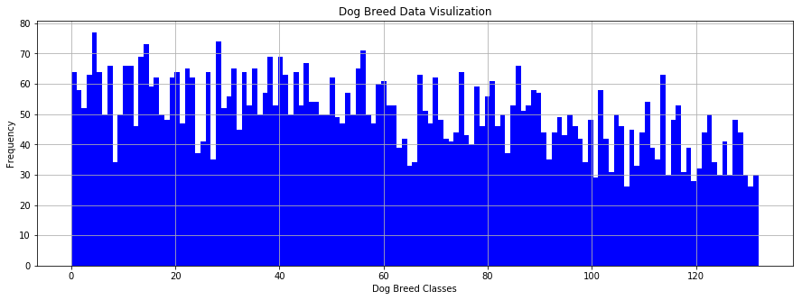


### Import Human Dataset

In the code cell below, we import a dataset of human images, where the file paths are stored in the numpy array `human_files`.


```python
random.seed(8675309)

# load filenames in shuffled human dataset
human_files = np.array(glob("lfw/*/*"))
random.shuffle(human_files)

# print statistics about the dataset
print('There are %d total human images.' % len(human_files))
```

    There are 13233 total human images.


---
<a id='step1'></a>
## Step 1: Detect Humans

We use OpenCV's implementation of [Haar feature-based cascade classifiers](http://docs.opencv.org/trunk/d7/d8b/tutorial_py_face_detection.html) to detect human faces in images.  OpenCV provides many pre-trained face detectors, stored as XML files on [github](https://github.com/opencv/opencv/tree/master/data/haarcascades).  We have downloaded one of these detectors and stored it in the `haarcascades` directory.

In the next code cell, we demonstrate how to use this detector to find human faces in a sample image.


```python
# extract pre-trained face detector
face_cascade = cv2.CascadeClassifier('haarcascades/haarcascade_frontalface_alt.xml')

# load color (BGR) image
img = cv2.imread(human_files[8])
# convert BGR image to grayscale
gray = cv2.cvtColor(img, cv2.COLOR_BGR2GRAY)

# find faces in image
faces = face_cascade.detectMultiScale(gray)

# print number of faces detected in the image
print('Number of faces detected:', len(faces))

# get bounding box for each detected face
for (x,y,w,h) in faces:
    # add bounding box to color image
    cv2.rectangle(img,(x,y),(x+w,y+h),(255,0,0),2)
    
# convert BGR image to RGB for plotting
cv_rgb = cv2.cvtColor(img, cv2.COLOR_BGR2RGB)

# display the image, along with bounding box
plt.imshow(cv_rgb)
plt.show()
```

    Number of faces detected: 1


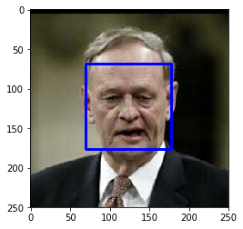


Before using any of the face detectors, it is standard procedure to convert the images to grayscale.  The `detectMultiScale` function executes the classifier stored in `face_cascade` and takes the grayscale image as a parameter.  

In the above code, `faces` is a numpy array of detected faces, where each row corresponds to a detected face.  Each detected face is a 1D array with four entries that specifies the bounding box of the detected face.  The first two entries in the array (extracted in the above code as `x` and `y`) specify the horizontal and vertical positions of the top left corner of the bounding box.  The last two entries in the array (extracted here as `w` and `h`) specify the width and height of the box.

### Write a Human Face Detector

We can use this procedure to write a function that returns `True` if a human face is detected in an image and `False` otherwise.  This function, aptly named `face_detector`, takes a string-valued file path to an image as input and appears in the code block below.


```python
# returns "True" if face is detected in image stored at img_path
def face_detector(img_path):
    img = cv2.imread(img_path)
    gray = cv2.cvtColor(img, cv2.COLOR_BGR2GRAY)
    faces = face_cascade.detectMultiScale(gray)
    return len(faces) > 0
```

### (IMPLEMENTATION) Assess the Human Face Detector

__Question 1:__ Use the code cell below to test the performance of the `face_detector` function.  
- What percentage of the first 100 images in `human_files` have a detected human face?  
- What percentage of the first 100 images in `dog_files` have a detected human face? 

Ideally, we would like 100% of human images with a detected face and 0% of dog images with a detected face.  You will see that our algorithm falls short of this goal, but still gives acceptable performance.  We extract the file paths for the first 100 images from each of the datasets and store them in the numpy arrays `human_files_short` and `dog_files_short`.

__Answer:__ It seems that 100% of human faces are correctly identified but interesting part is that 11% of the dog images are detected as human. 


```python
human_files_short = human_files[:100]
dog_files_short = train_files[:100]
# Do NOT modify the code above this line.

## TODO: Test the performance of the face_detector algorithm 
## on the images in human_files_short and dog_files_short.
correctHumanFaces = 0
wrongHumanFaces = 0
for img_ind in range(len(human_files_short)):
    #print(human_files_short[img_ind])
    tmp = face_detector(human_files_short[img_ind])
    if (tmp):
        correctHumanFaces += 1
for img_ind in range(len(dog_files_short)):
    #print(human_files_short[img_ind])
    tmp = face_detector(dog_files_short[img_ind])
    if (tmp):
        wrongHumanFaces += 1

print ("Correct Human Face Detection: {}%".format(100*correctHumanFaces/len(human_files_short)))
print ("Dog Faces Detection as Human: {}%".format(100*wrongHumanFaces/len(dog_files_short)))

```

    Correct Human Face Detection: 100.0%
    Dog Faces Detection as Human: 11.0%


__Question 2:__ This algorithmic choice necessitates that we communicate to the user that we accept human images only when they provide a clear view of a face (otherwise, we risk having unneccessarily frustrated users!). In your opinion, is this a reasonable expectation to pose on the user? If not, can you think of a way to detect humans in images that does not necessitate an image with a clearly presented face?

__Answer:__ As it is pointed out at the beginning of the notebook there is no model that is perfect for what we are aiming. I would think it is better to inform the users with the model limitations, providing only human pictures, that would be an acceptable approach.

We suggest the face detector from OpenCV as a potential way to detect human images in your algorithm, but you are free to explore other approaches, especially approaches that make use of deep learning :).  Please use the code cell below to design and test your own face detection algorithm.  If you decide to pursue this _optional_ task, report performance on each of the datasets.

### TODO: Report the performance of another  
### face detection algorithm on the LFW dataset
### Feel free to use as many code cells as needed.
Performance comparison is done at step 2. 

---
<a id='step2'></a>
## Step 2: Detect Dogs

In this section, we use a pre-trained [ResNet-50](http://ethereon.github.io/netscope/#/gist/db945b393d40bfa26006) model to detect dogs in images.  Our first line of code downloads the ResNet-50 model, along with weights that have been trained on [ImageNet](http://www.image-net.org/), a very large, very popular dataset used for image classification and other vision tasks.  ImageNet contains over 10 million URLs, each linking to an image containing an object from one of [1000 categories](https://gist.github.com/yrevar/942d3a0ac09ec9e5eb3a).  Given an image, this pre-trained ResNet-50 model returns a prediction (derived from the available categories in ImageNet) for the object that is contained in the image.


```python
# define ResNet50 model
ResNet50_model = ResNet50(weights='imagenet')
```

### Pre-process the Data

When using TensorFlow as backend, Keras CNNs require a 4D array (which we'll also refer to as a 4D tensor) as input, with shape

$$
(\text{nb_samples}, \text{rows}, \text{columns}, \text{channels}),
$$

where `nb_samples` corresponds to the total number of images (or samples), and `rows`, `columns`, and `channels` correspond to the number of rows, columns, and channels for each image, respectively.  

The `path_to_tensor` function below takes a string-valued file path to a color image as input and returns a 4D tensor suitable for supplying to a Keras CNN.  The function first loads the image and resizes it to a square image that is $224 \times 224$ pixels.  Next, the image is converted to an array, which is then resized to a 4D tensor.  In this case, since we are working with color images, each image has three channels.  Likewise, since we are processing a single image (or sample), the returned tensor will always have shape

$$
(1, 224, 224, 3).
$$

The `paths_to_tensor` function takes a numpy array of string-valued image paths as input and returns a 4D tensor with shape 

$$
(\text{nb_samples}, 224, 224, 3).
$$

Here, `nb_samples` is the number of samples, or number of images, in the supplied array of image paths.  It is best to think of `nb_samples` as the number of 3D tensors (where each 3D tensor corresponds to a different image) in your dataset!


```python
# Reading image
def read_image(file):
    img = cv2.imread(file)
    return cv2.cvtColor(img, cv2.COLOR_BGR2RGB)
    #return plt.imread(file)
# Resizing by 32x32x3
def resize_image(image):
    return cv2.resize(image,(224,224))
# Loading images 
def load_image(self):
    prep_image = lambda file: self.resize_image(self.read_image(file))
    [self.X_train.append(prep_image(self.X[i]) ) for i in range(self.X.shape[0])]  

def path_to_tensor(img_path):
    # loads RGB image as PIL.Image.Image type
    #img = image.load_img(img_path, target_size=(224, 224))
    img = read_image(img_path)
    img = resize_image(img)
    # convert PIL.Image.Image type to 3D tensor with shape (224, 224, 3)
    #x = image.img_to_array(img)
    x = np.array(img,dtype=float)
    # convert 3D tensor to 4D tensor with shape (1, 224, 224, 3) and return 4D tensor
    return np.expand_dims(x, axis=0)

def paths_to_tensor(img_paths):
    list_of_tensors = [path_to_tensor(img_path) for img_path in tqdm(img_paths)]
    return np.vstack(list_of_tensors)

```

### Making Predictions with ResNet-50

Getting the 4D tensor ready for ResNet-50, and for any other pre-trained model in Keras, requires some additional processing.  First, the RGB image is converted to BGR by reordering the channels.  All pre-trained models have the additional normalization step that the mean pixel (expressed in RGB as $[103.939, 116.779, 123.68]$ and calculated from all pixels in all images in ImageNet) must be subtracted from every pixel in each image.  This is implemented in the imported function `preprocess_input`.  If you're curious, you can check the code for `preprocess_input` [here](https://github.com/fchollet/keras/blob/master/keras/applications/imagenet_utils.py).

Now that we have a way to format our image for supplying to ResNet-50, we are now ready to use the model to extract the predictions.  This is accomplished with the `predict` method, which returns an array whose $i$-th entry is the model's predicted probability that the image belongs to the $i$-th ImageNet category.  This is implemented in the `ResNet50_predict_labels` function below.

By taking the argmax of the predicted probability vector, we obtain an integer corresponding to the model's predicted object class, which we can identify with an object category through the use of this [dictionary](https://gist.github.com/yrevar/942d3a0ac09ec9e5eb3a). 


```python
def ResNet50_predict_labels(img_path):
    # returns prediction vector for image located at img_path
    img = preprocess_input(path_to_tensor(img_path))
    return np.argmax(ResNet50_model.predict(img))
```

### Write a Dog Detector

While looking at the [dictionary](https://gist.github.com/yrevar/942d3a0ac09ec9e5eb3a), you will notice that the categories corresponding to dogs appear in an uninterrupted sequence and correspond to dictionary keys 151-268, inclusive, to include all categories from `'Chihuahua'` to `'Mexican hairless'`.  Thus, in order to check to see if an image is predicted to contain a dog by the pre-trained ResNet-50 model, we need only check if the `ResNet50_predict_labels` function above returns a value between 151 and 268 (inclusive).

We use these ideas to complete the `dog_detector` function below, which returns `True` if a dog is detected in an image (and `False` if not).


```python
### returns "True" if a dog is detected in the image stored at img_path
def dog_detector(img_path):
    prediction = ResNet50_predict_labels(img_path)
    return ((prediction <= 268) & (prediction >= 151)) 
```

### (IMPLEMENTATION) Assess the Dog Detector

__Question 3:__ Use the code cell below to test the performance of your `dog_detector` function.  
- What percentage of the images in `human_files_short` have a detected dog?  
- What percentage of the images in `dog_files_short` have a detected dog?

__Answer:__ The percentage of human faces detected as dog 1% and dog faces are detected 100% correctly.


```python
### TODO: Test the performance of the dog_detector function
### on the images in human_files_short and dog_files_short.
human_files_short = human_files[:100]
dog_files_short = train_files[:100]
# Do NOT modify the code above this line.

## TODO: Test the performance of the face_detector algorithm 
## on the images in human_files_short and dog_files_short.
correctHumanFaces = 0
wrongHumanFaces = 0
for img_ind in range(len(human_files_short)):
    #print(human_files_short[img_ind])
    tmp = dog_detector(human_files_short[img_ind])
    if (tmp):
        correctHumanFaces += 1
for img_ind in range(len(dog_files_short)):
    #print(human_files_short[img_ind])
    tmp = dog_detector(dog_files_short[img_ind])
    if (tmp):
        wrongHumanFaces += 1

print ("Human faces detected as dogs: {}%".format(100*correctHumanFaces/len(human_files_short)))
print ("Dog faces detected as dogs: {}%".format(100*wrongHumanFaces/len(dog_files_short)))

```

    Human faces detected as dogs: 1.0%
    Dog faces detected as dogs: 100.0%


---
<a id='step3'></a>
## Step 3: Create a CNN to Classify Dog Breeds (from Scratch)

Now that we have functions for detecting humans and dogs in images, we need a way to predict breed from images.  In this step, you will create a CNN that classifies dog breeds.  You must create your CNN _from scratch_ (so, you can't use transfer learning _yet_!), and you must attain a test accuracy of at least 1%.  In Step 5 of this notebook, you will have the opportunity to use transfer learning to create a CNN that attains greatly improved accuracy.

Be careful with adding too many trainable layers!  More parameters means longer training, which means you are more likely to need a GPU to accelerate the training process.  Thankfully, Keras provides a handy estimate of the time that each epoch is likely to take; you can extrapolate this estimate to figure out how long it will take for your algorithm to train. 

We mention that the task of assigning breed to dogs from images is considered exceptionally challenging.  To see why, consider that *even a human* would have great difficulty in distinguishing between a Brittany and a Welsh Springer Spaniel.  

Brittany | Welsh Springer Spaniel
- | - 
 | 

It is not difficult to find other dog breed pairs with minimal inter-class variation (for instance, Curly-Coated Retrievers and American Water Spaniels).  

Curly-Coated Retriever | American Water Spaniel
- | -
 | 


Likewise, recall that labradors come in yellow, chocolate, and black.  Your vision-based algorithm will have to conquer this high intra-class variation to determine how to classify all of these different shades as the same breed.  

Yellow Labrador | Chocolate Labrador | Black Labrador
- | -
 |  | 

We also mention that random chance presents an exceptionally low bar: setting aside the fact that the classes are slightly imabalanced, a random guess will provide a correct answer roughly 1 in 133 times, which corresponds to an accuracy of less than 1%.  

Remember that the practice is far ahead of the theory in deep learning.  Experiment with many different architectures, and trust your intuition.  And, of course, have fun! 

### Pre-process the Data

We rescale the images by dividing every pixel in every image by 255.


```python
# pre-process the data for Keras
train_tensors = paths_to_tensor(train_files).astype('float32')/255
valid_tensors = paths_to_tensor(valid_files).astype('float32')/255
test_tensors = paths_to_tensor(test_files).astype('float32')/255
```

    100%|██████████| 6680/6680 [00:48<00:00, 137.72it/s]
    100%|██████████| 835/835 [00:05<00:00, 150.58it/s]
    100%|██████████| 836/836 [00:05<00:00, 149.95it/s]


### (IMPLEMENTATION) Model Architecture

Create a CNN to classify dog breed.  At the end of your code cell block, summarize the layers of your model by executing the line:
    
        model.summary()

We have imported some Python modules to get you started, but feel free to import as many modules as you need.  If you end up getting stuck, here's a hint that specifies a model that trains relatively fast on CPU and attains >1% test accuracy in 5 epochs:


           
__Question 4:__ Outline the steps you took to get to your final CNN architecture and your reasoning at each step.  If you chose to use the hinted architecture above, describe why you think that CNN architecture should work well for the image classification task.

__Answer:__ The suggested architecture should produce a decent performance because we picked a CNN architecture which is much faster compared to Fully Connected Neutral Network architecutes. In the CNN, we only use fully connected layer at the last layer. Global average pooling will reduce the overfitting the data but still i don't think we have enough data to get the best performance. Fo that reason, the existing data augmented for more training data.   


```python
model = Sequential()

### TODO: Define your architecture.
model.add(Conv2D(filters=16, kernel_size=2, padding='same', activation='relu', input_shape=(224, 224, 3)))
model.add(MaxPooling2D(pool_size=2))
model.add(Conv2D(filters=32, kernel_size=2, padding='same', activation='relu'))
model.add(MaxPooling2D(pool_size=2))
model.add(Conv2D(filters=64, kernel_size=2, padding='same', activation='relu'))
model.add(MaxPooling2D(pool_size=2))
model.add(Dropout(0.5))
model.add(Flatten())
model.add(Dense(500, activation='relu'))
model.add(Dropout(0.5))
model.add(Dense(133, activation='softmax'))

model.summary()
```

    _________________________________________________________________
    Layer (type)                 Output Shape              Param #   
    =================================================================
    conv2d_25 (Conv2D)           (None, 224, 224, 16)      208       
    _________________________________________________________________
    max_pooling2d_2 (MaxPooling2 (None, 112, 112, 16)      0         
    _________________________________________________________________
    conv2d_26 (Conv2D)           (None, 112, 112, 32)      2080      
    _________________________________________________________________
    max_pooling2d_3 (MaxPooling2 (None, 56, 56, 32)        0         
    _________________________________________________________________
    conv2d_27 (Conv2D)           (None, 56, 56, 64)        8256      
    _________________________________________________________________
    max_pooling2d_4 (MaxPooling2 (None, 28, 28, 64)        0         
    _________________________________________________________________
    dropout_3 (Dropout)          (None, 28, 28, 64)        0         
    _________________________________________________________________
    flatten_2 (Flatten)          (None, 50176)             0         
    _________________________________________________________________
    dense_6 (Dense)              (None, 500)               25088500  
    _________________________________________________________________
    dropout_4 (Dropout)          (None, 500)               0         
    _________________________________________________________________
    dense_7 (Dense)              (None, 133)               66633     
    =================================================================
    Total params: 25,165,677
    Trainable params: 25,165,677
    Non-trainable params: 0
    _________________________________________________________________


### Compile the Model


```python
model.compile(optimizer='rmsprop', loss='categorical_crossentropy', metrics=['accuracy'])
```

### (IMPLEMENTATION) Train the Model

Train your model in the code cell below.  Use model checkpointing to save the model that attains the best validation loss.

You are welcome to [augment the training data](https://blog.keras.io/building-powerful-image-classification-models-using-very-little-data.html), but this is not a requirement. 

### Augmenting the training data


```python
datagen = ImageDataGenerator(
        rotation_range=40,
        width_shift_range=0.1,
        height_shift_range=0.1,
        shear_range=0.2,
        zoom_range=0.2,
        horizontal_flip=True,
        fill_mode='nearest')

dog_paths = np.array(glob("dogImages/train/*"))
for dog_path in dog_paths:
    name = dog_path.split("/")[-1]
    dog_images = np.array(glob(dog_path+"/*"))
    #print (dog_images)
    for dog_image in dog_images:
        try:
            print("dog_image: {}".format(dog_image))
            img = load_img(dog_image)  # this is a PIL image
            x = img_to_array(img)  # this is a Numpy array with shape (3, 150, 150)
            x = x.reshape((1,) + x.shape)  # this is a Numpy array with shape (1, 3, 150, 150)

            # the .flow() command below generates batches of randomly transformed images
            # and saves the results to the `preview/` directory
            i = 0
            for batch in datagen.flow(x, batch_size=1,
                                      save_to_dir=dog_path, save_prefix=name, save_format='jpeg'):
                i += 1
                if i > 1:
                    break  # otherwise the generator would loop indefinitely
        except:
            pass
```


```python
# load train, test, and validation datasets
train_files_ext, train_targets_ext = load_dataset('dogImages_ext/train')
valid_files_ext, valid_targets_ext = load_dataset('dogImages_ext/valid')
test_files_ext, test_targets_ext = load_dataset('dogImages_ext/test')

# load list of dog names
dog_names_ext = [item[20:-1] for item in sorted(glob("dogImagesExt/train/*/"))]

# print statistics about the dataset
print('There are %d total dog categories.' % len(dog_names_ext))
print('There are %s total dog images.\n' % len(np.hstack([train_files_ext, valid_files_ext, test_files_ext])))
print('There are %d training dog images.' % len(train_files_ext))
print('There are %d validation dog images.' % len(valid_files_ext))
print('There are %d test dog images.'% len(test_files_ext))
```

    There are 133 total dog categories.
    There are 21639 total dog images.
    
    There are 19968 training dog images.
    There are 835 validation dog images.
    There are 836 test dog images.


```python
# pre-process the data for Keras
train_tensors_ext = paths_to_tensor(train_files_ext).astype('float32')/255
valid_tensors_ext = paths_to_tensor(valid_files_ext).astype('float32')/255
test_tensors_ext = paths_to_tensor(test_files_ext).astype('float32')/255
```

    100%|██████████| 19968/19968 [05:25<00:00, 61.41it/s] 
    100%|██████████| 835/835 [01:15<00:00, 11.02it/s]
    100%|██████████| 836/836 [00:41<00:00, 20.35it/s]


```python
### TODO: specify the number of epochs that you would like to use to train the model.

epochs = 10

### Do NOT modify the code below this line.

checkpointer = ModelCheckpoint(filepath='saved_models/weights.best.from_scratch.hdf5', 
                               verbose=1, save_best_only=True)

model.fit(train_tensors_ext, train_targets_ext, 
          validation_data=(valid_tensors_ext, valid_targets_ext),
          epochs=epochs, batch_size=20, callbacks=[checkpointer], verbose=1)
```

    Train on 19968 samples, validate on 835 samples
    Epoch 1/10
    19960/19968 [============================>.] - ETA: 0s - loss: 4.5952 - acc: 0.0346
    Epoch 00001: val_loss improved from inf to 4.24911, saving model to saved_models/weights.best.from_scratch.hdf5
    19968/19968 [==============================] - 80s 4ms/step - loss: 4.5949 - acc: 0.0346 - val_loss: 4.2491 - val_acc: 0.0659
    Epoch 2/10
    19940/19968 [============================>.] - ETA: 0s - loss: 4.1012 - acc: 0.0801
    Epoch 00002: val_loss improved from 4.24911 to 4.06425, saving model to saved_models/weights.best.from_scratch.hdf5
    19968/19968 [==============================] - 31s 2ms/step - loss: 4.1013 - acc: 0.0801 - val_loss: 4.0643 - val_acc: 0.0814
    Epoch 3/10
    19940/19968 [============================>.] - ETA: 0s - loss: 3.8477 - acc: 0.1134
    Epoch 00003: val_loss improved from 4.06425 to 3.88797, saving model to saved_models/weights.best.from_scratch.hdf5
    19968/19968 [==============================] - 30s 1ms/step - loss: 3.8477 - acc: 0.1134 - val_loss: 3.8880 - val_acc: 0.1102
    Epoch 4/10
    19940/19968 [============================>.] - ETA: 0s - loss: 3.6453 - acc: 0.1522
    Epoch 00004: val_loss improved from 3.88797 to 3.85802, saving model to saved_models/weights.best.from_scratch.hdf5
    19968/19968 [==============================] - 30s 1ms/step - loss: 3.6447 - acc: 0.1523 - val_loss: 3.8580 - val_acc: 0.1222
    Epoch 5/10
    19940/19968 [============================>.] - ETA: 0s - loss: 3.5006 - acc: 0.1813
    Epoch 00005: val_loss did not improve
    19968/19968 [==============================] - 30s 1ms/step - loss: 3.5007 - acc: 0.1813 - val_loss: 3.9260 - val_acc: 0.1234
    Epoch 6/10
    19960/19968 [============================>.] - ETA: 0s - loss: 3.3596 - acc: 0.2086
    Epoch 00006: val_loss did not improve
    19968/19968 [==============================] - 30s 1ms/step - loss: 3.3598 - acc: 0.2086 - val_loss: 3.9708 - val_acc: 0.1150
    Epoch 7/10
    19940/19968 [============================>.] - ETA: 0s - loss: 3.2594 - acc: 0.2286
    Epoch 00007: val_loss did not improve
    19968/19968 [==============================] - 29s 1ms/step - loss: 3.2593 - acc: 0.2286 - val_loss: 4.2508 - val_acc: 0.1090
    Epoch 8/10
    19940/19968 [============================>.] - ETA: 0s - loss: 3.1643 - acc: 0.2559
    Epoch 00008: val_loss did not improve
    19968/19968 [==============================] - 30s 1ms/step - loss: 3.1633 - acc: 0.2561 - val_loss: 5.3354 - val_acc: 0.1186
    Epoch 9/10
    19940/19968 [============================>.] - ETA: 0s - loss: 3.0843 - acc: 0.2715
    Epoch 00009: val_loss did not improve
    19968/19968 [==============================] - 30s 1ms/step - loss: 3.0846 - acc: 0.2715 - val_loss: 4.0401 - val_acc: 0.1269
    Epoch 10/10
    19940/19968 [============================>.] - ETA: 0s - loss: 3.0254 - acc: 0.2897
    Epoch 00010: val_loss did not improve
    19968/19968 [==============================] - 30s 1ms/step - loss: 3.0261 - acc: 0.2896 - val_loss: 4.0077 - val_acc: 0.1006


    <keras.callbacks.History at 0x7f29751328d0>


### Load the Model with the Best Validation Loss


```python
model.load_weights('saved_models/weights.best.from_scratch.hdf5')
```

### Test the Model

Try out your model on the test dataset of dog images.  Ensure that your test accuracy is greater than 1%.


```python
# get index of predicted dog breed for each image in test set
dog_breed_predictions = [np.argmax(model.predict(np.expand_dims(tensor, axis=0))) for tensor in test_tensors]

# report test accuracy
test_accuracy = 100*np.sum(np.array(dog_breed_predictions)==np.argmax(test_targets, axis=1))/len(dog_breed_predictions)
print('Test accuracy: %.4f%%' % test_accuracy)
```

    Test accuracy: 13.0383%


---
<a id='step4'></a>
## Step 4: Use a CNN to Classify Dog Breeds

To reduce training time without sacrificing accuracy, we show you how to train a CNN using transfer learning.  In the following step, you will get a chance to use transfer learning to train your own CNN.

### Obtain Bottleneck Features


```python
bottleneck_features = np.load('bottleneck_features_VGG16/DogVGG16Data.npz')
train_VGG16 = bottleneck_features['train']
valid_VGG16 = bottleneck_features['valid']
test_VGG16 = bottleneck_features['test']
```

### Visualize training accuracy and loss


```python
def visual(history):
    # summarize history for accuracy
    plt.plot(history.history['acc'])
    plt.plot(history.history['val_acc'])
    plt.title('model accuracy')
    plt.ylabel('accuracy')
    plt.xlabel('epoch')
    plt.legend(['train', 'test'], loc='upper left')
    plt.show()
    # summarize history for loss
    plt.plot(history.history['loss'])
    plt.plot(history.history['val_loss'])
    plt.title('model loss')
    plt.ylabel('loss')
    plt.xlabel('epoch')
    plt.legend(['train', 'test'], loc='upper left')
    plt.show()
```

### Model Architecture

The model uses the the pre-trained VGG-16 model as a fixed feature extractor, where the last convolutional output of VGG-16 is fed as input to our model.  We only add a global average pooling layer and a fully connected layer, where the latter contains one node for each dog category and is equipped with a softmax.


```python
VGG16_model = Sequential()
VGG16_model.add(GlobalAveragePooling2D(input_shape=train_VGG16.shape[1:]))
VGG16_model.add(Dense(133, activation='softmax'))

VGG16_model.summary()
```

    _________________________________________________________________
    Layer (type)                 Output Shape              Param #   
    =================================================================
    global_average_pooling2d_1 ( (None, 512)               0         
    _________________________________________________________________
    dense_1 (Dense)              (None, 133)               68229     
    =================================================================
    Total params: 68,229
    Trainable params: 68,229
    Non-trainable params: 0
    _________________________________________________________________


### Compile the Model


```python
VGG16_model.compile(loss='categorical_crossentropy', optimizer='rmsprop', metrics=['accuracy'])
```

### Train the Model


```python
checkpointer = ModelCheckpoint(filepath='saved_models/weights.best.VGG16.hdf5', 
                               verbose=1, save_best_only=True)

history = VGG16_model.fit(train_VGG16, train_targets, 
          validation_data=(valid_VGG16, valid_targets),
          epochs=100, batch_size=20, callbacks=[checkpointer], verbose=1)
```

    Train on 6680 samples, validate on 835 samples
    Epoch 1/100
    6620/6680 [============================>.] - ETA: 0s - loss: 12.5158 - acc: 0.1192
    Epoch 00001: val_loss improved from inf to 11.04654, saving model to saved_models/weights.best.VGG16.hdf5
    6680/6680 [==============================] - 1s 148us/step - loss: 12.4896 - acc: 0.1201 - val_loss: 11.0465 - val_acc: 0.2168
    Epoch 2/100
    6620/6680 [============================>.] - ETA: 0s - loss: 10.5219 - acc: 0.2640
    Epoch 00002: val_loss improved from 11.04654 to 10.29679, saving model to saved_models/weights.best.VGG16.hdf5
    6680/6680 [==============================] - 1s 93us/step - loss: 10.5101 - acc: 0.2650 - val_loss: 10.2968 - val_acc: 0.2731
    Epoch 3/100
    6220/6680 [==========================>...] - ETA: 0s - loss: 9.8805 - acc: 0.3272
    Epoch 00003: val_loss improved from 10.29679 to 9.97249, saving model to saved_models/weights.best.VGG16.hdf5
    6680/6680 [==============================] - 1s 100us/step - loss: 9.8547 - acc: 0.3293 - val_loss: 9.9725 - val_acc: 0.2898
    Epoch 4/100
    6380/6680 [===========================>..] - ETA: 0s - loss: 9.4683 - acc: 0.3636
    Epoch 00004: val_loss improved from 9.97249 to 9.63596, saving model to saved_models/weights.best.VGG16.hdf5
    6680/6680 [==============================] - 1s 95us/step - loss: 9.4396 - acc: 0.3659 - val_loss: 9.6360 - val_acc: 0.3174
    Epoch 5/100
    6360/6680 [===========================>..] - ETA: 0s - loss: 9.1498 - acc: 0.3915
    Epoch 00005: val_loss improved from 9.63596 to 9.46917, saving model to saved_models/weights.best.VGG16.hdf5
    6680/6680 [==============================] - 1s 105us/step - loss: 9.1750 - acc: 0.3900 - val_loss: 9.4692 - val_acc: 0.3317
    Epoch 6/100
    6460/6680 [============================>.] - ETA: 0s - loss: 8.9100 - acc: 0.4104
    Epoch 00006: val_loss improved from 9.46917 to 9.39561, saving model to saved_models/weights.best.VGG16.hdf5
    6680/6680 [==============================] - 1s 120us/step - loss: 8.9304 - acc: 0.4093 - val_loss: 9.3956 - val_acc: 0.3329
    Epoch 7/100
    6340/6680 [===========================>..] - ETA: 0s - loss: 8.6399 - acc: 0.4312
    Epoch 00007: val_loss improved from 9.39561 to 9.10979, saving model to saved_models/weights.best.VGG16.hdf5
    6680/6680 [==============================] - 1s 105us/step - loss: 8.6019 - acc: 0.4340 - val_loss: 9.1098 - val_acc: 0.3641
    Epoch 8/100
    6240/6680 [===========================>..] - ETA: 0s - loss: 8.4859 - acc: 0.4518
    Epoch 00008: val_loss improved from 9.10979 to 8.86029, saving model to saved_models/weights.best.VGG16.hdf5
    6680/6680 [==============================] - 1s 124us/step - loss: 8.5007 - acc: 0.4504 - val_loss: 8.8603 - val_acc: 0.3868
    Epoch 9/100
    6340/6680 [===========================>..] - ETA: 0s - loss: 8.3417 - acc: 0.4588
    Epoch 00009: val_loss improved from 8.86029 to 8.81687, saving model to saved_models/weights.best.VGG16.hdf5
    6680/6680 [==============================] - 1s 123us/step - loss: 8.3971 - acc: 0.4552 - val_loss: 8.8169 - val_acc: 0.3760
    Epoch 10/100
    6300/6680 [===========================>..] - ETA: 0s - loss: 8.1239 - acc: 0.4751
    Epoch 00010: val_loss improved from 8.81687 to 8.60245, saving model to saved_models/weights.best.VGG16.hdf5
    6680/6680 [==============================] - 1s 124us/step - loss: 8.1388 - acc: 0.4732 - val_loss: 8.6025 - val_acc: 0.3820
    Epoch 11/100
    6120/6680 [==========================>...] - ETA: 0s - loss: 8.0102 - acc: 0.4871
    Epoch 00011: val_loss improved from 8.60245 to 8.48263, saving model to saved_models/weights.best.VGG16.hdf5
    6680/6680 [==============================] - 1s 107us/step - loss: 7.9894 - acc: 0.4885 - val_loss: 8.4826 - val_acc: 0.4048
    Epoch 12/100
    6420/6680 [===========================>..] - ETA: 0s - loss: 7.9054 - acc: 0.4935
    Epoch 00012: val_loss did not improve
    6680/6680 [==============================] - 1s 110us/step - loss: 7.8884 - acc: 0.4934 - val_loss: 8.4944 - val_acc: 0.3880
    Epoch 13/100
    6400/6680 [===========================>..] - ETA: 0s - loss: 7.6868 - acc: 0.5022
    Epoch 00013: val_loss improved from 8.48263 to 8.23792, saving model to saved_models/weights.best.VGG16.hdf5
    6680/6680 [==============================] - 1s 121us/step - loss: 7.6700 - acc: 0.5036 - val_loss: 8.2379 - val_acc: 0.4216
    Epoch 14/100
    6460/6680 [============================>.] - ETA: 0s - loss: 7.5368 - acc: 0.5176
    Epoch 00014: val_loss improved from 8.23792 to 8.11280, saving model to saved_models/weights.best.VGG16.hdf5
    6680/6680 [==============================] - 1s 104us/step - loss: 7.5476 - acc: 0.5166 - val_loss: 8.1128 - val_acc: 0.4192
    Epoch 15/100
    6420/6680 [===========================>..] - ETA: 0s - loss: 7.4828 - acc: 0.5248
    Epoch 00015: val_loss improved from 8.11280 to 8.03443, saving model to saved_models/weights.best.VGG16.hdf5
    6680/6680 [==============================] - 1s 103us/step - loss: 7.4650 - acc: 0.5260 - val_loss: 8.0344 - val_acc: 0.4287
    Epoch 16/100
    6160/6680 [==========================>...] - ETA: 0s - loss: 7.4486 - acc: 0.5266
    Epoch 00016: val_loss did not improve
    6680/6680 [==============================] - 1s 97us/step - loss: 7.3956 - acc: 0.5292 - val_loss: 8.0397 - val_acc: 0.4275
    Epoch 17/100
    6300/6680 [===========================>..] - ETA: 0s - loss: 7.0856 - acc: 0.5403
    Epoch 00017: val_loss improved from 8.03443 to 7.75539, saving model to saved_models/weights.best.VGG16.hdf5
    6680/6680 [==============================] - 1s 97us/step - loss: 7.0926 - acc: 0.5403 - val_loss: 7.7554 - val_acc: 0.4431
    Epoch 18/100
    6440/6680 [===========================>..] - ETA: 0s - loss: 6.9683 - acc: 0.5536
    Epoch 00018: val_loss improved from 7.75539 to 7.72481, saving model to saved_models/weights.best.VGG16.hdf5
    6680/6680 [==============================] - 1s 96us/step - loss: 6.9672 - acc: 0.5533 - val_loss: 7.7248 - val_acc: 0.4491
    Epoch 19/100
    6460/6680 [============================>.] - ETA: 0s - loss: 6.8854 - acc: 0.5598
    Epoch 00019: val_loss improved from 7.72481 to 7.71784, saving model to saved_models/weights.best.VGG16.hdf5
    6680/6680 [==============================] - 1s 95us/step - loss: 6.8699 - acc: 0.5609 - val_loss: 7.7178 - val_acc: 0.4479
    Epoch 20/100
    6220/6680 [==========================>...] - ETA: 0s - loss: 6.9024 - acc: 0.5632
    Epoch 00020: val_loss did not improve
    6680/6680 [==============================] - 1s 124us/step - loss: 6.8348 - acc: 0.5665 - val_loss: 7.7672 - val_acc: 0.4407
    Epoch 21/100
    6340/6680 [===========================>..] - ETA: 0s - loss: 6.7035 - acc: 0.5702
    Epoch 00021: val_loss improved from 7.71784 to 7.60452, saving model to saved_models/weights.best.VGG16.hdf5
    6680/6680 [==============================] - 1s 104us/step - loss: 6.7527 - acc: 0.5666 - val_loss: 7.6045 - val_acc: 0.4443
    Epoch 22/100
    6460/6680 [============================>.] - ETA: 0s - loss: 6.6650 - acc: 0.5743
    Epoch 00022: val_loss improved from 7.60452 to 7.57275, saving model to saved_models/weights.best.VGG16.hdf5
    6680/6680 [==============================] - 1s 94us/step - loss: 6.6599 - acc: 0.5744 - val_loss: 7.5727 - val_acc: 0.4599
    Epoch 23/100
    6560/6680 [============================>.] - ETA: 0s - loss: 6.6191 - acc: 0.5811
    Epoch 00023: val_loss did not improve
    6680/6680 [==============================] - 1s 100us/step - loss: 6.6134 - acc: 0.5814 - val_loss: 7.6376 - val_acc: 0.4527
    Epoch 24/100
    6160/6680 [==========================>...] - ETA: 0s - loss: 6.5059 - acc: 0.5826
    Epoch 00024: val_loss improved from 7.57275 to 7.56188, saving model to saved_models/weights.best.VGG16.hdf5
    6680/6680 [==============================] - 1s 99us/step - loss: 6.5066 - acc: 0.5826 - val_loss: 7.5619 - val_acc: 0.4599
    Epoch 25/100
    6220/6680 [==========================>...] - ETA: 0s - loss: 6.3607 - acc: 0.5915
    Epoch 00025: val_loss improved from 7.56188 to 7.34809, saving model to saved_models/weights.best.VGG16.hdf5
    6680/6680 [==============================] - 1s 97us/step - loss: 6.3520 - acc: 0.5915 - val_loss: 7.3481 - val_acc: 0.4623
    Epoch 26/100
    6640/6680 [============================>.] - ETA: 0s - loss: 6.2727 - acc: 0.5973
    Epoch 00026: val_loss improved from 7.34809 to 7.31621, saving model to saved_models/weights.best.VGG16.hdf5
    6680/6680 [==============================] - 1s 92us/step - loss: 6.2678 - acc: 0.5976 - val_loss: 7.3162 - val_acc: 0.4671
    Epoch 27/100
    6540/6680 [============================>.] - ETA: 0s - loss: 6.0077 - acc: 0.6066
    Epoch 00027: val_loss improved from 7.31621 to 7.19120, saving model to saved_models/weights.best.VGG16.hdf5
    6680/6680 [==============================] - 1s 95us/step - loss: 6.0252 - acc: 0.6057 - val_loss: 7.1912 - val_acc: 0.4659
    Epoch 28/100
    6320/6680 [===========================>..] - ETA: 0s - loss: 5.9545 - acc: 0.6196
    Epoch 00028: val_loss improved from 7.19120 to 7.02747, saving model to saved_models/weights.best.VGG16.hdf5
    6680/6680 [==============================] - 1s 115us/step - loss: 5.9363 - acc: 0.6207 - val_loss: 7.0275 - val_acc: 0.4802
    Epoch 29/100
    6660/6680 [============================>.] - ETA: 0s - loss: 5.8731 - acc: 0.6236
    Epoch 00029: val_loss improved from 7.02747 to 6.96573, saving model to saved_models/weights.best.VGG16.hdf5
    6680/6680 [==============================] - 1s 117us/step - loss: 5.8748 - acc: 0.6235 - val_loss: 6.9657 - val_acc: 0.4922
    Epoch 30/100
    6240/6680 [===========================>..] - ETA: 0s - loss: 5.8285 - acc: 0.6292
    Epoch 00030: val_loss did not improve
    6680/6680 [==============================] - 1s 115us/step - loss: 5.7841 - acc: 0.6317 - val_loss: 7.0717 - val_acc: 0.4802
    Epoch 31/100
    6340/6680 [===========================>..] - ETA: 0s - loss: 5.7559 - acc: 0.6360
    Epoch 00031: val_loss improved from 6.96573 to 6.84419, saving model to saved_models/weights.best.VGG16.hdf5
    6680/6680 [==============================] - 1s 142us/step - loss: 5.7534 - acc: 0.6361 - val_loss: 6.8442 - val_acc: 0.4934
    Epoch 32/100
    6300/6680 [===========================>..] - ETA: 0s - loss: 5.7534 - acc: 0.6386
    Epoch 00032: val_loss did not improve
    6680/6680 [==============================] - 1s 123us/step - loss: 5.7431 - acc: 0.6392 - val_loss: 6.8655 - val_acc: 0.4994
    Epoch 33/100
    6260/6680 [===========================>..] - ETA: 0s - loss: 5.7685 - acc: 0.6377
    Epoch 00033: val_loss did not improve
    6680/6680 [==============================] - 1s 123us/step - loss: 5.7379 - acc: 0.6391 - val_loss: 6.8843 - val_acc: 0.4934
    Epoch 34/100
    6340/6680 [===========================>..] - ETA: 0s - loss: 5.6521 - acc: 0.6418
    Epoch 00034: val_loss improved from 6.84419 to 6.79427, saving model to saved_models/weights.best.VGG16.hdf5
    6680/6680 [==============================] - 1s 120us/step - loss: 5.6702 - acc: 0.6407 - val_loss: 6.7943 - val_acc: 0.5030
    Epoch 35/100
    6320/6680 [===========================>..] - ETA: 0s - loss: 5.5869 - acc: 0.6495
    Epoch 00035: val_loss did not improve
    6680/6680 [==============================] - 1s 114us/step - loss: 5.5909 - acc: 0.6491 - val_loss: 6.8382 - val_acc: 0.5042
    Epoch 36/100
    6500/6680 [============================>.] - ETA: 0s - loss: 5.5374 - acc: 0.6486
    Epoch 00036: val_loss did not improve
    6680/6680 [==============================] - 1s 127us/step - loss: 5.5403 - acc: 0.6487 - val_loss: 6.8933 - val_acc: 0.4970
    Epoch 37/100
    6300/6680 [===========================>..] - ETA: 0s - loss: 5.5183 - acc: 0.6516
    Epoch 00037: val_loss improved from 6.79427 to 6.77822, saving model to saved_models/weights.best.VGG16.hdf5
    6680/6680 [==============================] - 1s 123us/step - loss: 5.5034 - acc: 0.6527 - val_loss: 6.7782 - val_acc: 0.5066
    Epoch 38/100
    6180/6680 [==========================>...] - ETA: 0s - loss: 5.4738 - acc: 0.6542
    Epoch 00038: val_loss improved from 6.77822 to 6.73282, saving model to saved_models/weights.best.VGG16.hdf5
    6680/6680 [==============================] - 1s 114us/step - loss: 5.4770 - acc: 0.6540 - val_loss: 6.7328 - val_acc: 0.5138
    Epoch 39/100
    6160/6680 [==========================>...] - ETA: 0s - loss: 5.4216 - acc: 0.6593
    Epoch 00039: val_loss did not improve
    6680/6680 [==============================] - 1s 90us/step - loss: 5.4535 - acc: 0.6570 - val_loss: 6.7996 - val_acc: 0.5102
    Epoch 40/100
    6440/6680 [===========================>..] - ETA: 0s - loss: 5.4673 - acc: 0.6568
    Epoch 00040: val_loss did not improve
    6680/6680 [==============================] - 1s 102us/step - loss: 5.4424 - acc: 0.6584 - val_loss: 6.7548 - val_acc: 0.5150
    Epoch 41/100
    6460/6680 [============================>.] - ETA: 0s - loss: 5.4389 - acc: 0.6601
    Epoch 00041: val_loss improved from 6.73282 to 6.63729, saving model to saved_models/weights.best.VGG16.hdf5
    6680/6680 [==============================] - 1s 103us/step - loss: 5.4363 - acc: 0.6602 - val_loss: 6.6373 - val_acc: 0.5198
    Epoch 42/100
    6440/6680 [===========================>..] - ETA: 0s - loss: 5.4307 - acc: 0.6604
    Epoch 00042: val_loss did not improve
    6680/6680 [==============================] - 1s 102us/step - loss: 5.4311 - acc: 0.6605 - val_loss: 6.6883 - val_acc: 0.5186
    Epoch 43/100
    6620/6680 [============================>.] - ETA: 0s - loss: 5.4334 - acc: 0.6619
    Epoch 00043: val_loss did not improve
    6680/6680 [==============================] - 1s 91us/step - loss: 5.4281 - acc: 0.6623 - val_loss: 6.7434 - val_acc: 0.5186
    Epoch 44/100
    6220/6680 [==========================>...] - ETA: 0s - loss: 5.4613 - acc: 0.6588
    Epoch 00044: val_loss did not improve
    6680/6680 [==============================] - 1s 89us/step - loss: 5.4283 - acc: 0.6609 - val_loss: 6.7103 - val_acc: 0.5114
    Epoch 45/100
    6520/6680 [============================>.] - ETA: 0s - loss: 5.4224 - acc: 0.6610
    Epoch 00045: val_loss did not improve
    6680/6680 [==============================] - 1s 93us/step - loss: 5.4180 - acc: 0.6614 - val_loss: 6.6707 - val_acc: 0.5138
    Epoch 46/100
    6540/6680 [============================>.] - ETA: 0s - loss: 5.3963 - acc: 0.6601
    Epoch 00046: val_loss did not improve
    6680/6680 [==============================] - 1s 92us/step - loss: 5.3890 - acc: 0.6606 - val_loss: 6.7298 - val_acc: 0.5126
    Epoch 47/100
    6200/6680 [==========================>...] - ETA: 0s - loss: 5.3408 - acc: 0.6619
    Epoch 00047: val_loss improved from 6.63729 to 6.51587, saving model to saved_models/weights.best.VGG16.hdf5
    6680/6680 [==============================] - 1s 97us/step - loss: 5.3104 - acc: 0.6633 - val_loss: 6.5159 - val_acc: 0.5078
    Epoch 48/100
    6320/6680 [===========================>..] - ETA: 0s - loss: 5.1626 - acc: 0.6696
    Epoch 00048: val_loss did not improve
    6680/6680 [==============================] - 1s 95us/step - loss: 5.1721 - acc: 0.6692 - val_loss: 6.5678 - val_acc: 0.5138
    Epoch 49/100
    6180/6680 [==========================>...] - ETA: 0s - loss: 5.0946 - acc: 0.6762
    Epoch 00049: val_loss improved from 6.51587 to 6.40778, saving model to saved_models/weights.best.VGG16.hdf5
    6680/6680 [==============================] - 1s 98us/step - loss: 5.0768 - acc: 0.6777 - val_loss: 6.4078 - val_acc: 0.5389
    Epoch 50/100
    6500/6680 [============================>.] - ETA: 0s - loss: 5.0408 - acc: 0.6840
    Epoch 00050: val_loss improved from 6.40778 to 6.39582, saving model to saved_models/weights.best.VGG16.hdf5
    6680/6680 [==============================] - 1s 95us/step - loss: 5.0498 - acc: 0.6835 - val_loss: 6.3958 - val_acc: 0.5377
    Epoch 51/100
    6380/6680 [===========================>..] - ETA: 0s - loss: 5.0369 - acc: 0.6832
    Epoch 00051: val_loss did not improve
    6680/6680 [==============================] - 1s 96us/step - loss: 5.0458 - acc: 0.6828 - val_loss: 6.4475 - val_acc: 0.5341
    Epoch 52/100
    6360/6680 [===========================>..] - ETA: 0s - loss: 5.0156 - acc: 0.6829
    Epoch 00052: val_loss did not improve
    6680/6680 [==============================] - 1s 96us/step - loss: 4.9906 - acc: 0.6846 - val_loss: 6.4369 - val_acc: 0.5365
    Epoch 53/100
    6360/6680 [===========================>..] - ETA: 0s - loss: 5.0005 - acc: 0.6865
    Epoch 00053: val_loss did not improve
    6680/6680 [==============================] - 1s 94us/step - loss: 4.9634 - acc: 0.6888 - val_loss: 6.4089 - val_acc: 0.5365
    Epoch 54/100
    6200/6680 [==========================>...] - ETA: 0s - loss: 4.9238 - acc: 0.6927
    Epoch 00054: val_loss improved from 6.39582 to 6.26084, saving model to saved_models/weights.best.VGG16.hdf5
    6680/6680 [==============================] - 1s 98us/step - loss: 4.9537 - acc: 0.6910 - val_loss: 6.2608 - val_acc: 0.5401
    Epoch 55/100
    6360/6680 [===========================>..] - ETA: 0s - loss: 4.9421 - acc: 0.6912
    Epoch 00055: val_loss did not improve
    6680/6680 [==============================] - 1s 96us/step - loss: 4.9453 - acc: 0.6907 - val_loss: 6.4517 - val_acc: 0.5234
    Epoch 56/100
    6260/6680 [===========================>..] - ETA: 0s - loss: 4.9173 - acc: 0.6909
    Epoch 00056: val_loss did not improve
    6680/6680 [==============================] - 1s 98us/step - loss: 4.9222 - acc: 0.6906 - val_loss: 6.2962 - val_acc: 0.5437
    Epoch 57/100
    6200/6680 [==========================>...] - ETA: 0s - loss: 4.8749 - acc: 0.6939
    Epoch 00057: val_loss did not improve
    6680/6680 [==============================] - 1s 97us/step - loss: 4.9011 - acc: 0.6925 - val_loss: 6.3459 - val_acc: 0.5389
    Epoch 58/100
    6620/6680 [============================>.] - ETA: 0s - loss: 4.8844 - acc: 0.6932
    Epoch 00058: val_loss did not improve
    6680/6680 [==============================] - 1s 100us/step - loss: 4.8752 - acc: 0.6937 - val_loss: 6.5047 - val_acc: 0.5269
    Epoch 59/100
    6460/6680 [============================>.] - ETA: 0s - loss: 4.8437 - acc: 0.6927
    Epoch 00059: val_loss did not improve
    6680/6680 [==============================] - 1s 102us/step - loss: 4.8098 - acc: 0.6949 - val_loss: 6.3184 - val_acc: 0.5341
    Epoch 60/100
    6440/6680 [===========================>..] - ETA: 0s - loss: 4.7600 - acc: 0.7000
    Epoch 00060: val_loss did not improve
    6680/6680 [==============================] - 1s 112us/step - loss: 4.7643 - acc: 0.6999 - val_loss: 6.2609 - val_acc: 0.5353
    Epoch 61/100
    6440/6680 [===========================>..] - ETA: 0s - loss: 4.7038 - acc: 0.7014
    Epoch 00061: val_loss improved from 6.26084 to 6.22478, saving model to saved_models/weights.best.VGG16.hdf5
    6680/6680 [==============================] - 1s 112us/step - loss: 4.7013 - acc: 0.7018 - val_loss: 6.2248 - val_acc: 0.5257
    Epoch 62/100
    6260/6680 [===========================>..] - ETA: 0s - loss: 4.7224 - acc: 0.7024
    Epoch 00062: val_loss improved from 6.22478 to 6.19458, saving model to saved_models/weights.best.VGG16.hdf5
    6680/6680 [==============================] - 1s 115us/step - loss: 4.6850 - acc: 0.7048 - val_loss: 6.1946 - val_acc: 0.5485
    Epoch 63/100
    6240/6680 [===========================>..] - ETA: 0s - loss: 4.6327 - acc: 0.7088
    Epoch 00063: val_loss improved from 6.19458 to 6.11408, saving model to saved_models/weights.best.VGG16.hdf5
    6680/6680 [==============================] - 1s 116us/step - loss: 4.6678 - acc: 0.7069 - val_loss: 6.1141 - val_acc: 0.5473
    Epoch 64/100
    6620/6680 [============================>.] - ETA: 0s - loss: 4.6603 - acc: 0.7092
    Epoch 00064: val_loss did not improve
    6680/6680 [==============================] - 1s 116us/step - loss: 4.6595 - acc: 0.7093 - val_loss: 6.1148 - val_acc: 0.5473
    Epoch 65/100
    6240/6680 [===========================>..] - ETA: 0s - loss: 4.6806 - acc: 0.7079
    Epoch 00065: val_loss improved from 6.11408 to 6.07058, saving model to saved_models/weights.best.VGG16.hdf5
    6680/6680 [==============================] - 1s 115us/step - loss: 4.6579 - acc: 0.7093 - val_loss: 6.0706 - val_acc: 0.5545
    Epoch 66/100
    6300/6680 [===========================>..] - ETA: 0s - loss: 4.5921 - acc: 0.7133
    Epoch 00066: val_loss did not improve
    6680/6680 [==============================] - 1s 123us/step - loss: 4.6546 - acc: 0.7093 - val_loss: 6.1247 - val_acc: 0.5533
    Epoch 67/100
    6400/6680 [===========================>..] - ETA: 0s - loss: 4.6312 - acc: 0.7120
    Epoch 00067: val_loss did not improve
    6680/6680 [==============================] - 1s 102us/step - loss: 4.6524 - acc: 0.7105 - val_loss: 6.0878 - val_acc: 0.5569
    Epoch 68/100
    6580/6680 [============================>.] - ETA: 0s - loss: 4.6454 - acc: 0.7109
    Epoch 00068: val_loss did not improve
    6680/6680 [==============================] - 1s 101us/step - loss: 4.6507 - acc: 0.7106 - val_loss: 6.1459 - val_acc: 0.5533
    Epoch 69/100
    6440/6680 [===========================>..] - ETA: 0s - loss: 4.5599 - acc: 0.7116
    Epoch 00069: val_loss improved from 6.07058 to 6.05665, saving model to saved_models/weights.best.VGG16.hdf5
    6680/6680 [==============================] - 1s 103us/step - loss: 4.5902 - acc: 0.7094 - val_loss: 6.0567 - val_acc: 0.5401
    Epoch 70/100
    6480/6680 [============================>.] - ETA: 0s - loss: 4.3630 - acc: 0.7231
    Epoch 00070: val_loss did not improve
    6680/6680 [==============================] - 1s 102us/step - loss: 4.3629 - acc: 0.7232 - val_loss: 6.0804 - val_acc: 0.5401
    Epoch 71/100
    6200/6680 [==========================>...] - ETA: 0s - loss: 4.3608 - acc: 0.7273
    Epoch 00071: val_loss improved from 6.05665 to 5.86044, saving model to saved_models/weights.best.VGG16.hdf5
    6680/6680 [==============================] - 1s 116us/step - loss: 4.3376 - acc: 0.7286 - val_loss: 5.8604 - val_acc: 0.5617
    Epoch 72/100
    6160/6680 [==========================>...] - ETA: 0s - loss: 4.3442 - acc: 0.7287
    Epoch 00072: val_loss improved from 5.86044 to 5.85648, saving model to saved_models/weights.best.VGG16.hdf5
    6680/6680 [==============================] - 1s 98us/step - loss: 4.3270 - acc: 0.7299 - val_loss: 5.8565 - val_acc: 0.5665
    Epoch 73/100
    6560/6680 [============================>.] - ETA: 0s - loss: 4.3312 - acc: 0.7303
    Epoch 00073: val_loss did not improve
    6680/6680 [==============================] - 1s 100us/step - loss: 4.3258 - acc: 0.7307 - val_loss: 5.8858 - val_acc: 0.5617
    Epoch 74/100
    6300/6680 [===========================>..] - ETA: 0s - loss: 4.3386 - acc: 0.7297
    Epoch 00074: val_loss did not improve
    6680/6680 [==============================] - 1s 97us/step - loss: 4.3247 - acc: 0.7305 - val_loss: 5.8966 - val_acc: 0.5593
    Epoch 75/100
    6220/6680 [==========================>...] - ETA: 0s - loss: 4.3323 - acc: 0.7302
    Epoch 00075: val_loss improved from 5.85648 to 5.85159, saving model to saved_models/weights.best.VGG16.hdf5
    6680/6680 [==============================] - 1s 98us/step - loss: 4.3235 - acc: 0.7308 - val_loss: 5.8516 - val_acc: 0.5605
    Epoch 76/100
    6120/6680 [==========================>...] - ETA: 0s - loss: 4.2782 - acc: 0.7337
    Epoch 00076: val_loss did not improve
    6680/6680 [==============================] - 1s 98us/step - loss: 4.3201 - acc: 0.7311 - val_loss: 5.8653 - val_acc: 0.5593
    Epoch 77/100
    6580/6680 [============================>.] - ETA: 0s - loss: 4.3296 - acc: 0.7310
    Epoch 00077: val_loss improved from 5.85159 to 5.84239, saving model to saved_models/weights.best.VGG16.hdf5
    6680/6680 [==============================] - 1s 101us/step - loss: 4.3203 - acc: 0.7316 - val_loss: 5.8424 - val_acc: 0.5665
    Epoch 78/100
    6300/6680 [===========================>..] - ETA: 0s - loss: 4.3705 - acc: 0.7283
    Epoch 00078: val_loss did not improve
    6680/6680 [==============================] - 1s 97us/step - loss: 4.3209 - acc: 0.7313 - val_loss: 5.8594 - val_acc: 0.5629
    Epoch 79/100
    6660/6680 [============================>.] - ETA: 0s - loss: 4.3184 - acc: 0.7314
    Epoch 00079: val_loss improved from 5.84239 to 5.83288, saving model to saved_models/weights.best.VGG16.hdf5
    6680/6680 [==============================] - 1s 92us/step - loss: 4.3223 - acc: 0.7311 - val_loss: 5.8329 - val_acc: 0.5701
    Epoch 80/100
    6620/6680 [============================>.] - ETA: 0s - loss: 4.2758 - acc: 0.7299
    Epoch 00080: val_loss did not improve
    6680/6680 [==============================] - 1s 91us/step - loss: 4.2881 - acc: 0.7292 - val_loss: 5.9784 - val_acc: 0.5581
    Epoch 81/100
    6300/6680 [===========================>..] - ETA: 0s - loss: 4.2198 - acc: 0.7298
    Epoch 00081: val_loss did not improve
    6680/6680 [==============================] - 1s 88us/step - loss: 4.2116 - acc: 0.7305 - val_loss: 6.0087 - val_acc: 0.5461
    Epoch 82/100
    6520/6680 [============================>.] - ETA: 0s - loss: 4.1770 - acc: 0.7356
    Epoch 00082: val_loss did not improve
    6680/6680 [==============================] - 1s 94us/step - loss: 4.1684 - acc: 0.7361 - val_loss: 5.8335 - val_acc: 0.5641
    Epoch 83/100
    6500/6680 [============================>.] - ETA: 0s - loss: 4.1608 - acc: 0.7369
    Epoch 00083: val_loss improved from 5.83288 to 5.78849, saving model to saved_models/weights.best.VGG16.hdf5
    6680/6680 [==============================] - 1s 93us/step - loss: 4.1489 - acc: 0.7376 - val_loss: 5.7885 - val_acc: 0.5689
    Epoch 84/100
    6080/6680 [==========================>...] - ETA: 0s - loss: 4.1164 - acc: 0.7418
    Epoch 00084: val_loss did not improve
    6680/6680 [==============================] - 1s 91us/step - loss: 4.1412 - acc: 0.7401 - val_loss: 5.8263 - val_acc: 0.5605
    Epoch 85/100
    6340/6680 [===========================>..] - ETA: 0s - loss: 4.1282 - acc: 0.7415
    Epoch 00085: val_loss improved from 5.78849 to 5.77630, saving model to saved_models/weights.best.VGG16.hdf5
    6680/6680 [==============================] - 1s 114us/step - loss: 4.1322 - acc: 0.7412 - val_loss: 5.7763 - val_acc: 0.5725
    Epoch 86/100
    6460/6680 [============================>.] - ETA: 0s - loss: 4.1515 - acc: 0.7412
    Epoch 00086: val_loss improved from 5.77630 to 5.74371, saving model to saved_models/weights.best.VGG16.hdf5
    6680/6680 [==============================] - 1s 113us/step - loss: 4.1257 - acc: 0.7428 - val_loss: 5.7437 - val_acc: 0.5737
    Epoch 87/100
    6660/6680 [============================>.] - ETA: 0s - loss: 4.1250 - acc: 0.7422
    Epoch 00087: val_loss improved from 5.74371 to 5.74172, saving model to saved_models/weights.best.VGG16.hdf5
    6680/6680 [==============================] - 1s 116us/step - loss: 4.1272 - acc: 0.7421 - val_loss: 5.7417 - val_acc: 0.5772
    Epoch 88/100
    6320/6680 [===========================>..] - ETA: 0s - loss: 4.1039 - acc: 0.7437
    Epoch 00088: val_loss improved from 5.74172 to 5.68823, saving model to saved_models/weights.best.VGG16.hdf5
    6680/6680 [==============================] - 1s 115us/step - loss: 4.1216 - acc: 0.7427 - val_loss: 5.6882 - val_acc: 0.5760
    Epoch 89/100
    6260/6680 [===========================>..] - ETA: 0s - loss: 4.1134 - acc: 0.7438
    Epoch 00089: val_loss did not improve
    6680/6680 [==============================] - 1s 114us/step - loss: 4.1250 - acc: 0.7431 - val_loss: 5.7029 - val_acc: 0.5725
    Epoch 90/100
    6260/6680 [===========================>..] - ETA: 0s - loss: 4.1155 - acc: 0.7430
    Epoch 00090: val_loss did not improve
    6680/6680 [==============================] - 1s 112us/step - loss: 4.1247 - acc: 0.7425 - val_loss: 5.7542 - val_acc: 0.5737
    Epoch 91/100
    6220/6680 [==========================>...] - ETA: 0s - loss: 4.1720 - acc: 0.7402
    Epoch 00091: val_loss did not improve
    6680/6680 [==============================] - 1s 99us/step - loss: 4.1214 - acc: 0.7433 - val_loss: 5.7588 - val_acc: 0.5760
    Epoch 92/100
    6280/6680 [===========================>..] - ETA: 0s - loss: 4.1162 - acc: 0.7436
    Epoch 00092: val_loss did not improve
    6680/6680 [==============================] - 1s 140us/step - loss: 4.1193 - acc: 0.7434 - val_loss: 5.6938 - val_acc: 0.5796
    Epoch 93/100
    6380/6680 [===========================>..] - ETA: 0s - loss: 4.0952 - acc: 0.7450
    Epoch 00093: val_loss did not improve
    6680/6680 [==============================] - 1s 111us/step - loss: 4.1200 - acc: 0.7434 - val_loss: 5.7121 - val_acc: 0.5784
    Epoch 94/100
    6360/6680 [===========================>..] - ETA: 0s - loss: 4.1297 - acc: 0.7434
    Epoch 00094: val_loss did not improve
    6680/6680 [==============================] - 1s 104us/step - loss: 4.1178 - acc: 0.7440 - val_loss: 5.7167 - val_acc: 0.5808
    Epoch 95/100
    6520/6680 [============================>.] - ETA: 0s - loss: 4.1605 - acc: 0.7413
    Epoch 00095: val_loss did not improve
    6680/6680 [==============================] - 1s 103us/step - loss: 4.1188 - acc: 0.7439 - val_loss: 5.7865 - val_acc: 0.5772
    Epoch 96/100
    6560/6680 [============================>.] - ETA: 0s - loss: 4.1373 - acc: 0.7428
    Epoch 00096: val_loss did not improve
    6680/6680 [==============================] - 1s 101us/step - loss: 4.1184 - acc: 0.7440 - val_loss: 5.7061 - val_acc: 0.5796
    Epoch 97/100
    6640/6680 [============================>.] - ETA: 0s - loss: 4.1162 - acc: 0.7443
    Epoch 00097: val_loss did not improve
    6680/6680 [==============================] - 1s 108us/step - loss: 4.1180 - acc: 0.7442 - val_loss: 5.7124 - val_acc: 0.5796
    Epoch 98/100
    6580/6680 [============================>.] - ETA: 0s - loss: 4.1045 - acc: 0.7447
    Epoch 00098: val_loss improved from 5.68823 to 5.66767, saving model to saved_models/weights.best.VGG16.hdf5
    6680/6680 [==============================] - 1s 127us/step - loss: 4.1179 - acc: 0.7439 - val_loss: 5.6677 - val_acc: 0.5856
    Epoch 99/100
    6640/6680 [============================>.] - ETA: 0s - loss: 4.1081 - acc: 0.7446
    Epoch 00099: val_loss did not improve
    6680/6680 [==============================] - 1s 100us/step - loss: 4.1173 - acc: 0.7440 - val_loss: 5.7027 - val_acc: 0.5820
    Epoch 100/100
    6320/6680 [===========================>..] - ETA: 0s - loss: 4.1116 - acc: 0.7448
    Epoch 00100: val_loss did not improve
    6680/6680 [==============================] - 1s 96us/step - loss: 4.1192 - acc: 0.7443 - val_loss: 5.7226 - val_acc: 0.5832


### Load the Model with the Best Validation Loss


```python
VGG16_model.load_weights('saved_models/weights.best.VGG16.hdf5')
```

### Test the Model

Now, we can use the CNN to test how well it identifies breed within our test dataset of dog images.  We print the test accuracy below.


```python
# get index of predicted dog breed for each image in test set
VGG16_predictions = [np.argmax(VGG16_model.predict(np.expand_dims(feature, axis=0))) for feature in test_VGG16]

# report test accuracy
test_accuracy = 100*np.sum(np.array(VGG16_predictions)==np.argmax(test_targets, axis=1))/len(VGG16_predictions)
print('Test accuracy: %.4f%%' % test_accuracy)
```

    Test accuracy: 59.3301%


### Accuracy and Loss Graphs

From the graphs below it seems that test accuracy is much lower compared to training which indicates that the model is overfitted. We might try to augment the data and train for more epochs with more training data. 


```python
visual(history)
```


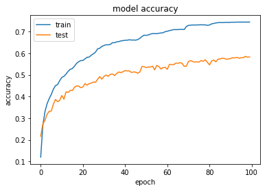


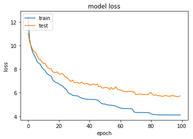


### Predict Dog Breed with the Model


```python
def VGG16_predict_breed(img_path):
    # extract bottleneck features
    bottleneck_feature = extract_VGG16(path_to_tensor(img_path))
    # obtain predicted vector
    predicted_vector = VGG16_model.predict(bottleneck_feature)
    # return dog breed that is predicted by the model
    return dog_names[np.argmax(predicted_vector)]

```

---
<a id='step5'></a>
## Step 5: Create a CNN to Classify Dog Breeds (using Transfer Learning)

You will now use transfer learning to create a CNN that can identify dog breed from images.  Your CNN must attain at least 60% accuracy on the test set.

In Step 4, we used transfer learning to create a CNN using VGG-16 bottleneck features.  In this section, you must use the bottleneck features from a different pre-trained model.  To make things easier for you, we have pre-computed the features for all of the networks that are currently available in Keras:
- [VGG-19](https://s3-us-west-1.amazonaws.com/udacity-aind/dog-project/DogVGG19Data.npz) bottleneck features
- [ResNet-50](https://s3-us-west-1.amazonaws.com/udacity-aind/dog-project/DogResnet50Data.npz) bottleneck features
- [Inception](https://s3-us-west-1.amazonaws.com/udacity-aind/dog-project/DogInceptionV3Data.npz) bottleneck features
- [Xception](https://s3-us-west-1.amazonaws.com/udacity-aind/dog-project/DogXceptionData.npz) bottleneck features

The files are encoded as such:

    Dog{network}Data.npz
    
where `{network}`, in the above filename, can be one of `VGG19`, `Resnet50`, `InceptionV3`, or `Xception`.  Pick one of the above architectures, download the corresponding bottleneck features, and store the downloaded file in the `bottleneck_features/` folder in the repository.

### (IMPLEMENTATION) Obtain Bottleneck Features

In the code block below, extract the bottleneck features corresponding to the train, test, and validation sets by running the following:

    bottleneck_features = np.load('bottleneck_features/Dog{network}Data.npz')
    train_{network} = bottleneck_features['train']
    valid_{network} = bottleneck_features['valid']
    test_{network} = bottleneck_features['test']
    
I have trained with other models and the best Xception model gave the best accuracy. 


```python
### TODO: Obtain bottleneck features from another pre-trained CNN.
### Resnet50 
bottleneck_features = np.load('bottleneck_features_Xception/DogXceptionData.npz')
train_X = bottleneck_features['train']
valid_X = bottleneck_features['valid']
test_X = bottleneck_features['test']
```

### (IMPLEMENTATION) Model Architecture

Create a CNN to classify dog breed.  At the end of your code cell block, summarize the layers of your model by executing the line:
    
        <your model's name>.summary()
   
__Question 5:__ Outline the steps you took to get to your final CNN architecture and your reasoning at each step.  Describe why you think the architecture is suitable for the current problem.

__Answer:__ 


```python
### TODO: Define your architecture.
model = Sequential()
model.add(GlobalAveragePooling2D(input_shape=train_X.shape[1:]))
model.add(Dense(256, activation='relu'))
model.add(Dropout(0.5))
model.add(Dense(133, activation='softmax'))
model.summary()
```

    _________________________________________________________________
    Layer (type)                 Output Shape              Param #   
    =================================================================
    global_average_pooling2d_3 ( (None, 2048)              0         
    _________________________________________________________________
    dense_4 (Dense)              (None, 256)               524544    
    _________________________________________________________________
    dropout_2 (Dropout)          (None, 256)               0         
    _________________________________________________________________
    dense_5 (Dense)              (None, 133)               34181     
    =================================================================
    Total params: 558,725
    Trainable params: 558,725
    Non-trainable params: 0
    _________________________________________________________________


### (IMPLEMENTATION) Compile the Model


```python
### TODO: Compile the model.
sgd = optimizers.SGD(lr=0.01, decay=1e-6, momentum=0.9, nesterov=True)
model.compile(loss='categorical_crossentropy', optimizer=sgd, metrics=['accuracy'])
```

### (IMPLEMENTATION) Train the Model

Train your model in the code cell below.  Use model checkpointing to save the model that attains the best validation loss.  

You are welcome to [augment the training data](https://blog.keras.io/building-powerful-image-classification-models-using-very-little-data.html), but this is not a requirement. 


```python
### TODO: Train the model.
checkpointer = ModelCheckpoint(filepath='saved_models/weights.best.model.hdf5', 
                               verbose=1, save_best_only=True)

history = model.fit(train_X, train_targets, 
          validation_data=(valid_X, valid_targets),
          epochs=20, batch_size=20, callbacks=[checkpointer], verbose=1)
```

    Train on 6680 samples, validate on 835 samples
    Epoch 1/20
    6400/6680 [===========================>..] - ETA: 0s - loss: 2.1116 - acc: 0.5283
    Epoch 00001: val_loss improved from inf to 0.73739, saving model to saved_models/weights.best.model.hdf5
    6680/6680 [==============================] - 2s 253us/step - loss: 2.0648 - acc: 0.5364 - val_loss: 0.7374 - val_acc: 0.7689
    Epoch 2/20
    6580/6680 [============================>.] - ETA: 0s - loss: 0.8048 - acc: 0.7631
    Epoch 00002: val_loss improved from 0.73739 to 0.60213, saving model to saved_models/weights.best.model.hdf5
    6680/6680 [==============================] - 1s 185us/step - loss: 0.8050 - acc: 0.7627 - val_loss: 0.6021 - val_acc: 0.8072
    Epoch 3/20
    6660/6680 [============================>.] - ETA: 0s - loss: 0.6403 - acc: 0.8048
    Epoch 00003: val_loss improved from 0.60213 to 0.55252, saving model to saved_models/weights.best.model.hdf5
    6680/6680 [==============================] - 1s 189us/step - loss: 0.6421 - acc: 0.8042 - val_loss: 0.5525 - val_acc: 0.8323
    Epoch 4/20
    6580/6680 [============================>.] - ETA: 0s - loss: 0.5453 - acc: 0.8330
    Epoch 00004: val_loss improved from 0.55252 to 0.54801, saving model to saved_models/weights.best.model.hdf5
    6680/6680 [==============================] - 1s 200us/step - loss: 0.5460 - acc: 0.8326 - val_loss: 0.5480 - val_acc: 0.8251
    Epoch 5/20
    6500/6680 [============================>.] - ETA: 0s - loss: 0.4698 - acc: 0.8515
    Epoch 00005: val_loss improved from 0.54801 to 0.50943, saving model to saved_models/weights.best.model.hdf5
    6680/6680 [==============================] - 1s 205us/step - loss: 0.4671 - acc: 0.8524 - val_loss: 0.5094 - val_acc: 0.8455
    Epoch 6/20
    6540/6680 [============================>.] - ETA: 0s - loss: 0.4145 - acc: 0.8702
    Epoch 00006: val_loss improved from 0.50943 to 0.48241, saving model to saved_models/weights.best.model.hdf5
    6680/6680 [==============================] - 1s 183us/step - loss: 0.4164 - acc: 0.8702 - val_loss: 0.4824 - val_acc: 0.8551
    Epoch 7/20
    6440/6680 [===========================>..] - ETA: 0s - loss: 0.3743 - acc: 0.8797
    Epoch 00007: val_loss did not improve
    6680/6680 [==============================] - 1s 209us/step - loss: 0.3755 - acc: 0.8798 - val_loss: 0.5022 - val_acc: 0.8431
    Epoch 8/20
    6420/6680 [===========================>..] - ETA: 0s - loss: 0.3543 - acc: 0.8854
    Epoch 00008: val_loss did not improve
    6680/6680 [==============================] - 1s 203us/step - loss: 0.3542 - acc: 0.8862 - val_loss: 0.5055 - val_acc: 0.8419
    Epoch 9/20
    6620/6680 [============================>.] - ETA: 0s - loss: 0.3092 - acc: 0.8958
    Epoch 00009: val_loss did not improve
    6680/6680 [==============================] - 1s 222us/step - loss: 0.3099 - acc: 0.8957 - val_loss: 0.5001 - val_acc: 0.8551
    Epoch 10/20
    6480/6680 [============================>.] - ETA: 0s - loss: 0.2804 - acc: 0.9086
    Epoch 00010: val_loss did not improve
    6680/6680 [==============================] - 1s 201us/step - loss: 0.2788 - acc: 0.9091 - val_loss: 0.4996 - val_acc: 0.8479
    Epoch 11/20
    6520/6680 [============================>.] - ETA: 0s - loss: 0.2528 - acc: 0.9210
    Epoch 00011: val_loss did not improve
    6680/6680 [==============================] - 1s 181us/step - loss: 0.2532 - acc: 0.9208 - val_loss: 0.4841 - val_acc: 0.8527
    Epoch 12/20
    6440/6680 [===========================>..] - ETA: 0s - loss: 0.2320 - acc: 0.9197
    Epoch 00012: val_loss improved from 0.48241 to 0.47822, saving model to saved_models/weights.best.model.hdf5
    6680/6680 [==============================] - 1s 187us/step - loss: 0.2305 - acc: 0.9202 - val_loss: 0.4782 - val_acc: 0.8563
    Epoch 13/20
    6380/6680 [===========================>..] - ETA: 0s - loss: 0.2162 - acc: 0.9298
    Epoch 00013: val_loss did not improve
    6680/6680 [==============================] - 1s 186us/step - loss: 0.2166 - acc: 0.9296 - val_loss: 0.4989 - val_acc: 0.8527
    Epoch 14/20
    6540/6680 [============================>.] - ETA: 0s - loss: 0.1966 - acc: 0.9355
    Epoch 00014: val_loss improved from 0.47822 to 0.47212, saving model to saved_models/weights.best.model.hdf5
    6680/6680 [==============================] - 1s 185us/step - loss: 0.1956 - acc: 0.9362 - val_loss: 0.4721 - val_acc: 0.8467
    Epoch 15/20
    6380/6680 [===========================>..] - ETA: 0s - loss: 0.1698 - acc: 0.9464
    Epoch 00015: val_loss did not improve
    6680/6680 [==============================] - 1s 187us/step - loss: 0.1722 - acc: 0.9452 - val_loss: 0.5398 - val_acc: 0.8419
    Epoch 16/20
    6500/6680 [============================>.] - ETA: 0s - loss: 0.1704 - acc: 0.9426
    Epoch 00016: val_loss did not improve
    6680/6680 [==============================] - 1s 184us/step - loss: 0.1704 - acc: 0.9425 - val_loss: 0.4978 - val_acc: 0.8575
    Epoch 17/20
    6560/6680 [============================>.] - ETA: 0s - loss: 0.1521 - acc: 0.9479
    Epoch 00017: val_loss did not improve
    6680/6680 [==============================] - 1s 208us/step - loss: 0.1532 - acc: 0.9475 - val_loss: 0.4850 - val_acc: 0.8479
    Epoch 18/20
    6440/6680 [===========================>..] - ETA: 0s - loss: 0.1533 - acc: 0.9500
    Epoch 00018: val_loss did not improve
    6680/6680 [==============================] - 1s 186us/step - loss: 0.1537 - acc: 0.9500 - val_loss: 0.5053 - val_acc: 0.8491
    Epoch 19/20
    6400/6680 [===========================>..] - ETA: 0s - loss: 0.1423 - acc: 0.9537
    Epoch 00019: val_loss did not improve
    6680/6680 [==============================] - 1s 185us/step - loss: 0.1422 - acc: 0.9536 - val_loss: 0.5247 - val_acc: 0.8527
    Epoch 20/20
    6480/6680 [============================>.] - ETA: 0s - loss: 0.1221 - acc: 0.9640
    Epoch 00020: val_loss did not improve
    6680/6680 [==============================] - 1s 182us/step - loss: 0.1232 - acc: 0.9633 - val_loss: 0.5041 - val_acc: 0.8431


### Accuracy and Loss Graphs

From the graphs below we can tell that this model definitely overfitted and we need more training data to reduce the overfitting. I have tried with multiple drop out at the end of the model but it didn't improve much. 


```python
visual(history)
```


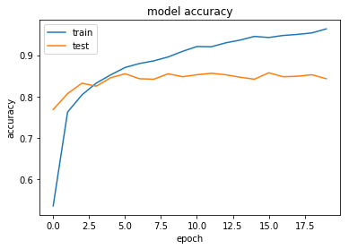


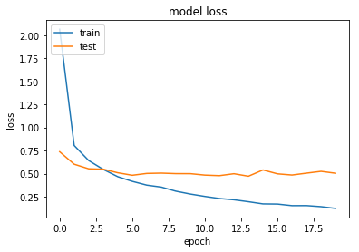


### (IMPLEMENTATION) Load the Model with the Best Validation Loss


```python
### TODO: Load the model weights with the best validation loss.
model.load_weights('saved_models/weights.best.model.hdf5')
```

### (IMPLEMENTATION) Test the Model

Try out your model on the test dataset of dog images. Ensure that your test accuracy is greater than 60%.


```python
### TODO: Calculate classification accuracy on the test dataset.
# get index of predicted dog breed for each image in test set
predictions = [np.argmax(model.predict(np.expand_dims(feature, axis=0))) for feature in test_X]

# report test accuracy
test_accuracy = 100*np.sum(np.array(predictions)==np.argmax(test_targets, axis=1))/len(predictions)
print('Test accuracy: %.4f%%' % test_accuracy)
```

    Test accuracy: 84.3301%


### (IMPLEMENTATION) Predict Dog Breed with the Model

Write a function that takes an image path as input and returns the dog breed (`Affenpinscher`, `Afghan_hound`, etc) that is predicted by your model.  

Similar to the analogous function in Step 5, your function should have three steps:
1. Extract the bottleneck features corresponding to the chosen CNN model.
2. Supply the bottleneck features as input to the model to return the predicted vector.  Note that the argmax of this prediction vector gives the index of the predicted dog breed.
3. Use the `dog_names` array defined in Step 0 of this notebook to return the corresponding breed.

The functions to extract the bottleneck features can be found in `extract_bottleneck_features.py`, and they have been imported in an earlier code cell.  To obtain the bottleneck features corresponding to your chosen CNN architecture, you need to use the function

    extract_{network}
    
where `{network}`, in the above filename, should be one of `VGG19`, `Resnet50`, `InceptionV3`, or `Xception`.


```python
### TODO: Write a function that takes a path to an image as input
### and returns the dog breed that is predicted by the model.
def predict_breed(img_path):
    # extract bottleneck features
    bottleneck_feature = extract_Xception(path_to_tensor(img_path))
    # obtain predicted vector
    predicted_vector = model.predict(bottleneck_feature)
    # return dog breed that is predicted by the model
    #return dog_names[np.argmax(predicted_vector)]
    return np.argmax(predicted_vector)
```


```python
### returns "True" if a dog is detected in the image stored at img_path
def dog_detector(img_path):
    prediction = predict_breed(img_path)
    return ((prediction <= 268) & (prediction >= 151)) 
```

### Dog Breed Classification

I plotted classified dog images with using the model and only two images missclasified among 20 images as shown below. 


```python
# plot a random sample of test images, their predicted labels, and ground truth
fig = plt.figure(figsize=(20, 8))
for i in range(20):
    ax = fig.add_subplot(5, 4, i + 1, xticks=[], yticks=[])
    img = cv2.imread(test_files[i])
    img = cv2.cvtColor(img, cv2.COLOR_BGR2RGB)
    ax.imshow(np.squeeze(img))
    #ax.set_title("{}".format(dog_names[i]))
    real_name = np.argmax(test_targets, axis=1)[i]
    pred_name = np.argmax(model.predict(np.expand_dims(test_X[i], axis=0)))
    ax.set_title("{} ({})".format(dog_names[pred_name],dog_names[real_name]),color=("green" if pred_name == real_name else "red"))

```


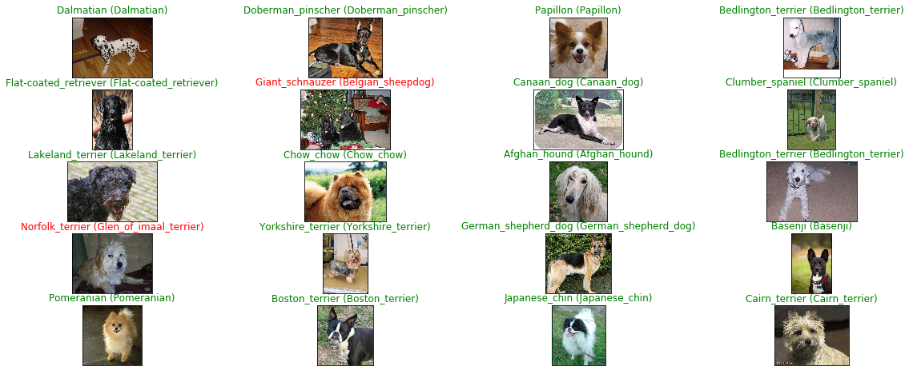

---
<a id='step6'></a>
## Step 6: Write your Algorithm

Write an algorithm that accepts a file path to an image and first determines whether the image contains a human, dog, or neither.  Then,
- if a __dog__ is detected in the image, return the predicted breed.
- if a __human__ is detected in the image, return the resembling dog breed.
- if __neither__ is detected in the image, provide output that indicates an error.

You are welcome to write your own functions for detecting humans and dogs in images, but feel free to use the `face_detector` and `dog_detector` functions developed above.  You are __required__ to use your CNN from Step 5 to predict dog breed.  

Some sample output for our algorithm is provided below, but feel free to design your own user experience!


### (IMPLEMENTATION) Write your Algorithm

```python
def imgClassification(file_name):
    human = face_detector(file_name)
    print ("human: {}".format(human))
    if (not human):
        fig = plt.figure(figsize=(20, 8))
        ax = fig.add_subplot(1, 2, 1, xticks=[], yticks=[])
        img = cv2.imread(file_name)
        img = cv2.cvtColor(img, cv2.COLOR_BGR2RGB)
        img = resize_image(img)
        ax.imshow(np.squeeze(img))
        name = dog_names[predict_breed(file_name)]
        print ("Dog prediction: {}".format(name))
        ax.set_title("{} ".format(name))
    elif (human):
        fig = plt.figure(figsize=(20, 8))
        ax = fig.add_subplot(1, 2, 1, xticks=[], yticks=[])
        img = cv2.imread(file_name)
        img = cv2.cvtColor(img, cv2.COLOR_BGR2RGB)
        img = resize_image(img)
        #img = np.expand_dims(x, axis=0)
        ax.imshow(np.squeeze(img))
        name = dog_names[predict_breed(file_name)]
        ax.set_title("{} ".format(name))
        str_name = "dogImages/test/*"+name+"*"
        dog_path = np.array(glob(str_name+"/*"))
        ay = fig.add_subplot(1, 2, 2, xticks=[], yticks=[])
        img = cv2.imread(dog_path[0])
        img = cv2.cvtColor(img, cv2.COLOR_BGR2RGB)
        img = resize_image(img)
        ay.imshow(np.squeeze(img))
        ay.set_title("{} ".format(name))
        print("Human face resembles to: {}".format(name))

    else:
        print("Error: Neither human nor dog detected !!!")


```

---
<a id='step7'></a>
## Step 7: Test Your Algorithm

In this section, you will take your new algorithm for a spin!  What kind of dog does the algorithm think that __you__ look like?  If you have a dog, does it predict your dog's breed accurately?  If you have a cat, does it mistakenly think that your cat is a dog?

### (IMPLEMENTATION) Test Your Algorithm on Sample Images!

Test your algorithm at least six images on your computer.  Feel free to use any images you like.  Use at least two human and two dog images.  

__Question 6:__ Is the output better than you expected :) ?  Or worse :( ?  Provide at least three possible points of improvement for your algorithm.

__Answer:__ Overall the result is not bad compared to data size. The biggest improvement probably to have more training data with more augementation so that model can be more generalized. Other things can be played with hyper parameters, gradient decent optimizer, weight distributions, etc ... 


```python
## TODO: Execute your algorithm from Step 6 on
## at least 6 images on your computer.

imgClassification("images/oucler.jpeg")
imgClassification("images/sample_human_output.png")
imgClassification("images/Brittany_02625.jpg")
imgClassification("images/Curly-coated_retriever_03896.jpg")
imgClassification("images/Welsh_springer_spaniel_08203.jpg")
imgClassification("images/Labrador_retriever_06457.jpg")
```

    human: True
    Human face resembles to: Cardigan_welsh_corgi
    human: True
    Human face resembles to: Chinese_shar-pei
    human: False
    Dog prediction: Brittany
    human: False
    Dog prediction: Curly-coated_retriever
    human: False
    Dog prediction: Welsh_springer_spaniel
    human: False
    Dog prediction: Labrador_retriever


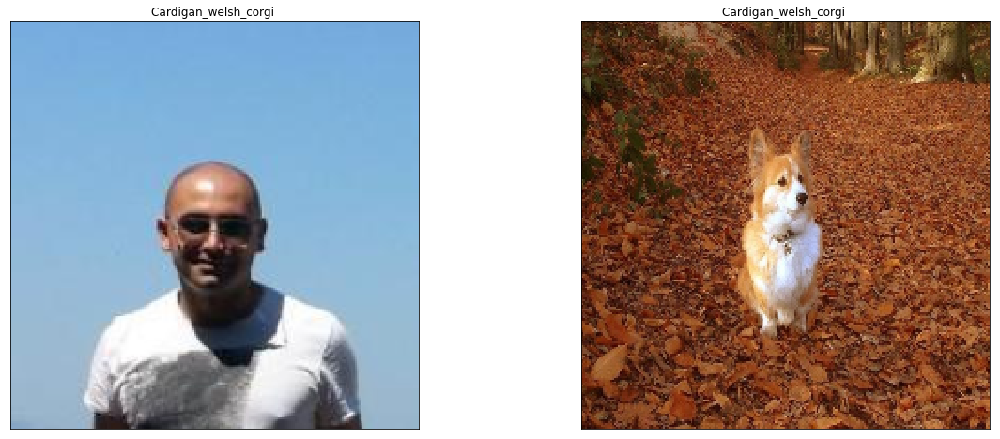


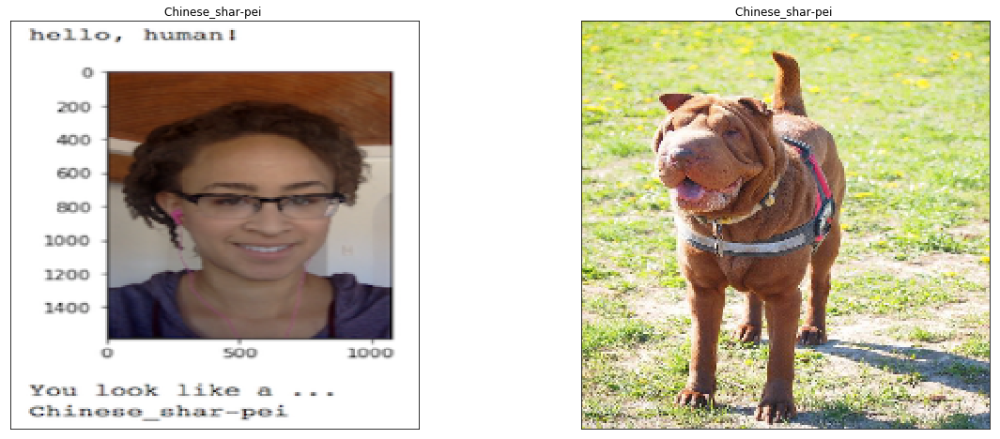


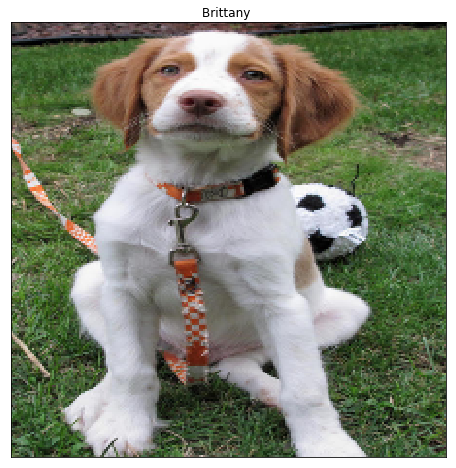


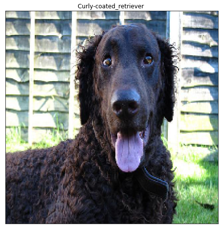


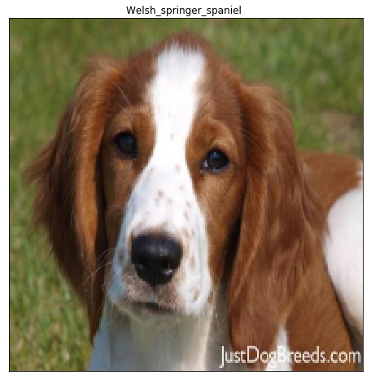


